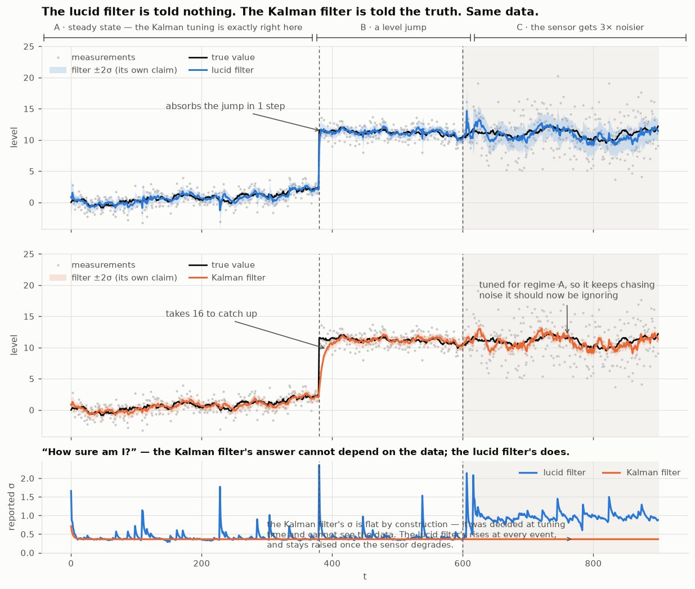
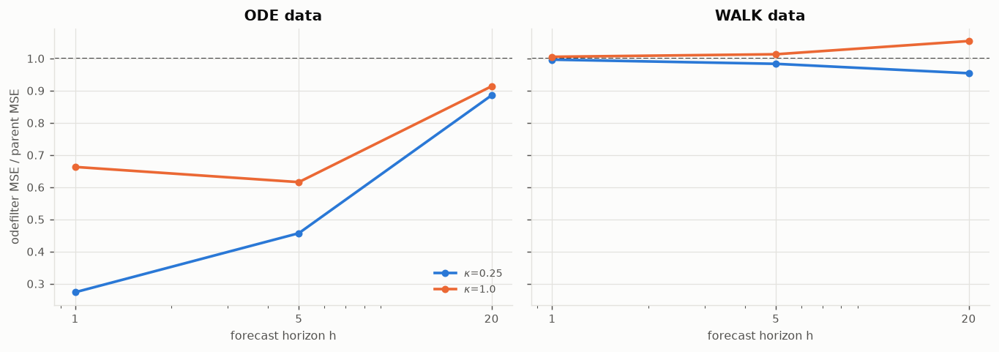
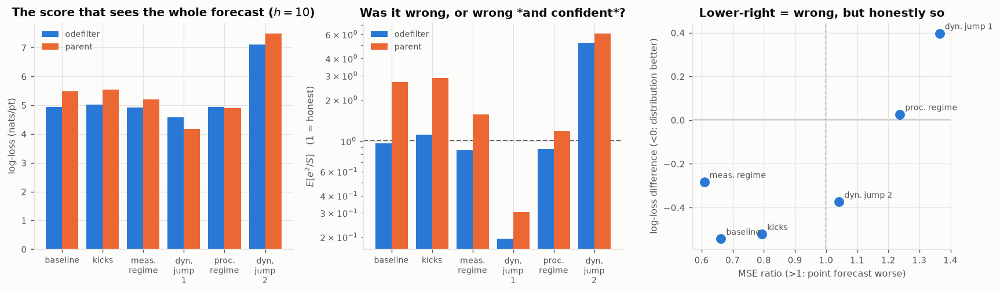
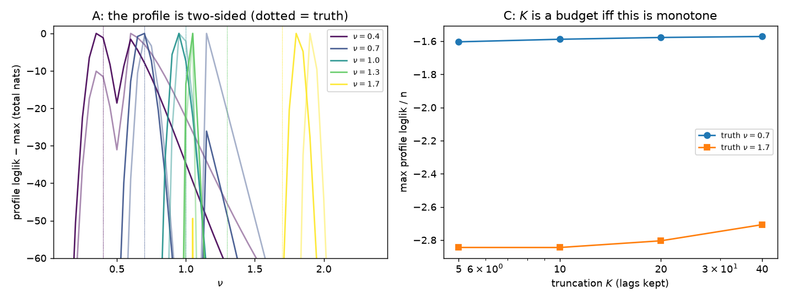
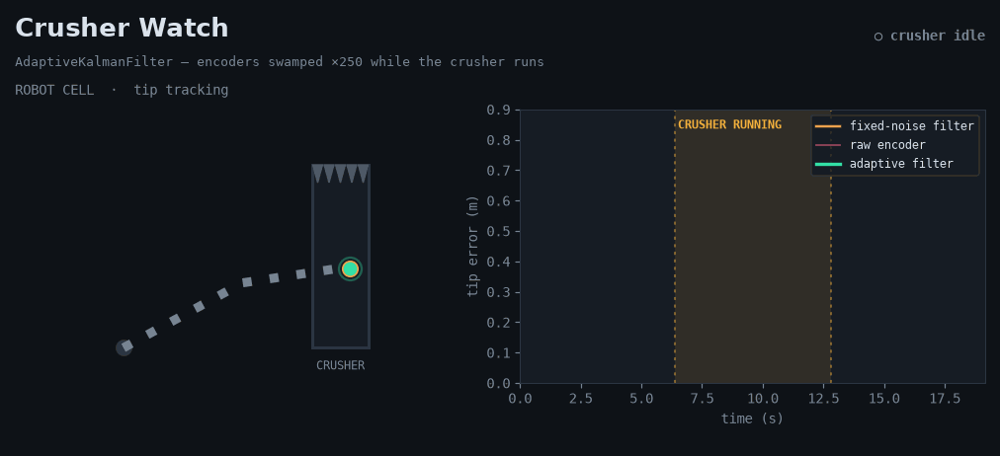
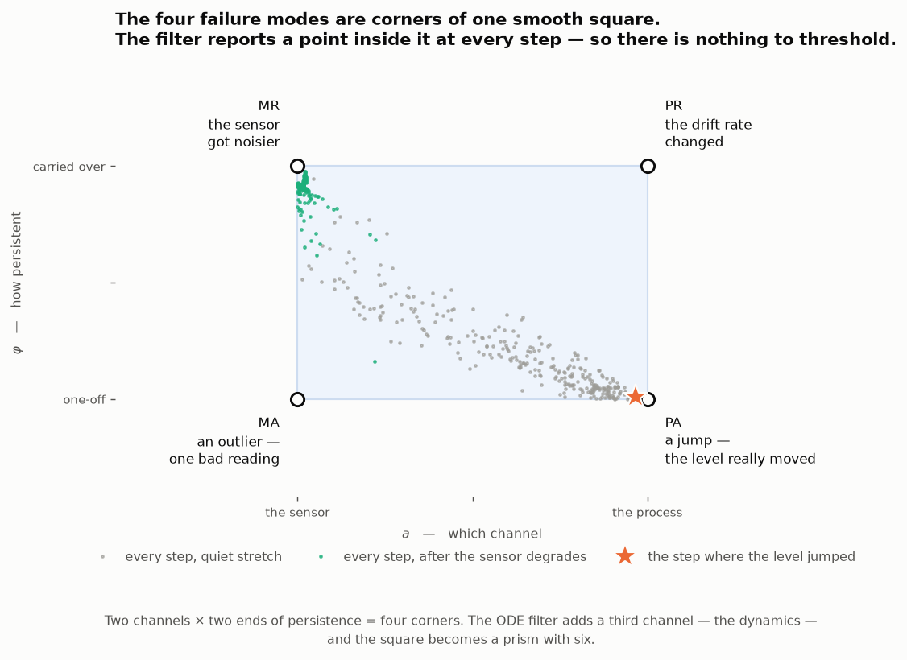

# lucid

**Adaptive filters with no theoretically relevant free parameters.**

Real-world data is noisy, and regimes change. Look at this graph.



The true value is jittery and its measurements are noisy — a sensor operating
under vibration, a drone on a windy day. Then the level jumps, and later the
sensor itself degrades.

On the steady stretch the lucid filter tracks the truth to **within a few
percent** of the Kalman filter's error — and the Kalman filter is *provably
optimal* there, because it was **told** the true process and measurement
variances. The lucid filter was told nothing.

Then the level jumps. The lucid filter absorbs it in **1 step**; the Kalman
filter takes **16**, because a fixed gain must average a jump away over its own
memory. And when the sensor degrades, the two filters' point accuracy is a wash
— but their honesty is not. Scored against its own claim, the Kalman filter's
error is **4.6× larger than the uncertainty it reports**: its error bars are
half the width they should be, and it has no way to notice. The lucid filter's
are right. **It knows what it doesn't know, and reports the gap.**

**None of that comes from the training run.** It is worth being exact about
what `fit()` does, because it is easy to mistake for the whole story. It is
called once, and what it picks is a *class* — how fast each noise scale is
allowed to move, and roughly how big it is. It does **not** pick the operating
point. Where the scales actually are at time *t* is a posterior recomputed from
evidence at **every single step**; `update()` never touches the parameters at
all. Everything above happens online, on one pass, with no refitting and no
lookahead.

Which is why the fit does not have to be good. Sweeping each fitted coordinate
across its range and rerunning the whole series
([`README-003`](research/random-walk-filter/scripts/README-003-the-fit-is-an-envelope.py)):
five of the six can be wrong by factors of two to ten and almost nothing moves —
the process persistence $\varphi_P$ is flat anywhere from 0 to 0.8, and $Q$
tolerates two decades. A **deliberately careless** vector, every coordinate set
to a wrong round number, tracks the steady stretch to **+0.5% of the oracle-tuned
Kalman** — better than the properly fitted vector does. The fit is choosing a
point on a cheap trade-off, not a setting that has to be right.

The one coordinate that is not forgiving, $s_P$, is not a precision setting
either — it is closer to a switch. It has to be large enough for the process
channel to exist at all; below about 2 the channel is effectively off, the jump
takes hundreds of steps instead of one, and the reported uncertainty stops
meaning anything. That is the same boundary the
[`oracle-gap`](research/oracle-gap/SUMMARY.md) workstream found and priced, and
it is the reason the training history has to contain the kind of disturbance the
deployment will actually see. Fitted on quiet data, $s_P$ pins at zero and takes
the channel with it.

*(Numbers and figure: [`README-001`](research/random-walk-filter/scripts/README-001-hero-lucid-vs-kalman.py)
and [`README-003`](research/random-walk-filter/scripts/README-003-the-fit-is-an-envelope.py),
which regenerate both. Neither filter is refitted on the series shown.)*

---

A *lucid filter* is a state estimator — an observer, in the control-engineering
sense — for systems whose dynamics can change while they are running. It is a
Kalman filter at every node of a quadrature grid, and exactly one ordinary
Kalman filter when the scale channels are off. The family is named by its model
class: the **lucid random walk filter**, the **lucid ODE filter**, and the
in-progress **lucid fractional filter**.

The handful of numbers these filters need are learned from data by maximum
marginal likelihood, once. There are no thresholds, no forgetting factors, no
changepoint detectors, no windows to pick, and no hyperparameters to tune. You
hand a filter a stretch of history to fix its class, and from then on it runs
online — one causal pass, no refitting, no lookahead.

A *compute budget* is not a free parameter: it trades a real-world cost (time)
against theoretical accuracy and nothing else, so it is allowed and is always
labelled as such. Quadrature resolutions are budgets. Model order is a
commitment. Everything else is fitted.

---

## What is in here

The repository is split in two, because the two halves have different
audiences and should not constrain each other.

```
lucid/       the product   — the installable package and its tests
research/    the iceberg   — every probe, proof and figure behind it
```

**[`lucid/`](lucid/README.md) is self-contained.** It is one distribution
(`lucid-filter`) with no dependency on anything in `research/`; you can take it
alone and never read another word. See [its README](lucid/README.md) for the
API.

**[`research/`](research/README.md) is why any of it is true.** Six
workstreams, each a `SUMMARY.md` that is kept falsifiable and the numbered
probes that produced it:

| workstream | state |
|---|---|
| [`random-walk-filter/`](research/random-walk-filter/SUMMARY.md) | **delivered** — `statfilter`, a tuning-free filter for an unbiased random walk observed with noise |
| [`ode-filter/`](research/ode-filter/SUMMARY.md) | **candidate shipped** — `odefilter`, the same idea for processes locally described by a linear ODE, plus the offset channel for the lead/lag between two series |
| [`multivariate-statfilter/`](research/multivariate-statfilter/SUMMARY.md) | **delivered** — `AdaptiveKalmanFilter`, a supplied-dynamics/supplied-`H` vector filter that learns per-component process and sensor noise online (the robotics/derivative mode) |
| [`optimality-proof/`](research/optimality-proof/SUMMARY.md) | one layer proved, one measured, one open — where "optimal" does and does not hold, and why the *class* of processes was the hard part |
| [`oracle-gap/`](research/oracle-gap/SUMMARY.md) | how far the filter is from an oracle told the noise schedule exactly, decomposed line by line — and the repair that closed most of it |
| [`fractional-filter/`](research/fractional-filter/SUMMARY.md) | **in progress** — model order made continuous: $\nu$ is learnable from both sides with an error bar, recovers the parent at $\hat\nu\approx1$, and one coordinate beats $p$ free ones at fractional orders |

Probes in `research/` import the package from `lucid/` by relative path, so the
dependency runs one way only: the product never reaches into the research.

---

## Why this matters

### Near-oracle accuracy at a cost you can afford

The strongest benchmark available is an **oracle**: a filter handed the true
noise schedule, the true parameters, or both. That is the ceiling nothing
causal can beat.

- Against a noise-schedule oracle, the ODE filter's **causal ceiling is 96.3%
  of the oracle's advantage**, and the decomposition says exactly where each
  piece goes: 80.0% the shipped channel, 9.5% the covariance collapse
  (repairable, and repaired), 6.8% the channel model, and **3.7% irreducible
  detection lag** — you cannot react to a regime before evidence of it exists.
  Almost nothing about this gap is fundamental
  ([`oracle-gap/0007`](research/oracle-gap/0007_decomposing_the_remaining_gap.py)).
  At the tier the no-regression gate constructs, the shipped filter measures
  81–90% across seeds.
- Against a true-parameter oracle, the fitted filters sit **under 1% of the
  oracle's negative log-likelihood on their own class** (0.07%–0.70% for the
  fractional face filter; residual 0.34%–0.47% for the parent's gate)
  ([`fractional-filter/0010`](research/fractional-filter/0010_the_oracle_gap_in_two_currencies.py)).
- Against a constant-gain Kalman filter *tuned in hindsight per series*, the
  random-walk filter's error ratio has a geometric mean of **0.678** over a
  9-probe battery, worst case **1.017**, and lands within 0.5% of optimal on
  stationary diffusions where the Kalman filter is provably optimal.

The cost of that is a small mixture over a quadrature grid. Filtering and
streaming are cheap — a handful of small matrix operations per sample, no
sampling, no backward pass, no optimiser in the loop. The expensive step is
the one-off offline `fit()`, and it is expensive only because the likelihood
replays a sequential recursion in Python — one that cannot be vectorised,
because it is sequential in time. For the parent filter the per-step arithmetic
is a 5×5 grid, and profiling attributes almost all of the cost to numpy call
overhead rather than flops; a compiled implementation is estimated at roughly
**40× faster**. That is a language cost, not an algorithmic one.

So the deployment shape is: `fit()` once, offline, to fix the class — then
stream forever, fully online, at near-oracle accuracy on a budget an embedded
target can carry. Nothing after the fit is a batch operation, and nothing after
the fit revisits the parameters: the adaptation is the scale posterior moving,
step by step, on evidence.

### Physical systems whose dynamics change while you are flying them

A second-order linear ODE is the local model of essentially every mechanical
system: a mass with a restoring force and damping. The interesting case is when
the ODE *changes* mid-run — a drone that loses part of a propeller, a joint that
develops friction, a payload that shifts, a wing that ices. The airframe's modes
move, and every filter tuned to the old modes is now confidently wrong.

Most systems handle this with a forgetting factor, a sliding window, or a
changepoint detector — each one a tuning knob, and each one a way to throw away
good evidence in order to be able to react to bad news. This filter has none of
them. Instead, **"the dynamics have stopped governing" is a member of the model
family with its own likelihood.** The `dynamics` output is the posterior mean of
a scalar $g$: how much of the fitted ODE is in force right now, where $g=0$ is
*exactly* the parent random-walk model and $g=1$ is the fitted ODE. The filter
falls toward $g=0$ on affirmative evidence and comes back when the evidence
does — no decay, no threshold, nothing to tune.

Alongside it, `whiteness` (the running lag-1 innovation autocorrelation) is a
free always-on residual check that stays at ~0 for a one-off disturbance of any
size — a gust *is* process noise — and departs from 0 when the dynamics
themselves no longer fit. It is cumulative, so it is a smoke alarm, not a
controller; `dynamics` is the controller.

Two honest caveats. $g$ is one scalar along one direction: it says how much of
the fitted departure-from-flat is in force, and **it cannot express a change of
frequency**. And nothing here has been flown. The mechanism is measured on
synthetic systems with known ground truth; hardware validation is not part of
this repository.

---

## Performance

*Every figure below is regenerated by the numbered script next to it; nothing is
drawn by hand.*

### The ODE filter against the random-walk parent



Forecast MSE ratio, filter over parent, lower is better. On its target class it
forecasts **1.5–3.7× better** at short horizons. On a plain random walk — the
parent's *own* model, where a strict extension has everything to lose — it costs
within ±5%.

The gain decaying with horizon is not a defect; it was predicted before the
filter existed. The oscillator's memory is $1/(1-|z|)$, here 19.6 steps, so by
$h=20$ only the unit root is left and the parent models that too.

| data | $\kappa$ | $h{=}1$ | $h{=}5$ | $h{=}20$ |
|---|---|---|---|---|
| **ODE** (target class) | 0.25 | **0.273** | **0.457** | 0.885 |
| **ODE** | 1.00 | **0.663** | **0.616** | 0.914 |
| WALK (the parent's own model) | 0.25 | 0.996 | 0.983 | 0.954 |
| WALK | 1.00 | 1.005 | 1.013 | 1.054 |

### Dynamics that stop, and come back


The damaged-propeller case in miniature. The ODE governs, then stops (shaded),
then resumes. The middle panel is the filter's own belief about whether its
fitted dynamics apply: it falls to $g\approx0.33$ within a few dozen samples of
the change, holds there, and snaps back the moment the dynamics return. **No
forgetting factor is involved** — the flat model is a hypothesis with a
likelihood, so evidence alone moves the posterior, in both directions.

The bottom panel is the price and the payoff: adaptive beats static throughout
the regime it detects, and pays a brief, visible spike at the return — the
detection lag, which is the part of the oracle gap that is genuinely
irreducible.

### Being wrong versus being wrong *and confident*



Point error is the wrong lens for a filter whose job is to say what it does not
know. On a series whose assumptions expire mid-run, the two filters' point
forecasts are level — but the ODE filter's forecast *distribution* is better by
**0.289 nats/point**, and it is calibrated ($E[e^2/S]\approx1$) exactly where
the parent is **1.6–2.9× overconfident**. The right-hand panel is the summary:
points below the line are honest about their own error even when the point
forecast is worse.

### How fast a change can possibly be detected


Evidence for a velocity mode accumulates as $n^3$ and for an acceleration mode
as $n^5$, so the number of samples needed to notice a change of dynamics is
small and sharply bounded. From a cold start the posterior converges to its
steady state within about 10 measurements in all three coordinates. This is the
budget that sets how quickly the `dynamics` channel in the previous figure can
possibly react.

### Order as a continuous, estimable coordinate



The integer order $p$ was the one genuinely categorical axis left in the filter
— learnable from below, nearly blind from above. Replacing it with a fractional
order $\nu$ makes it a coordinate with a two-sided likelihood profile and an
honest error bar: $\hat\nu = 1.03/1.04$ at a truth of 1.0 with a profile SE of
0.02–0.05, and prequentially **one fractional coordinate beats $p$ free integer
ones** by +0.024 nats/pt at $\nu=1.3$ and +0.117 at $\nu=1.7$.

---

## The filters

### `statfilter` — the random-walk parent
[`lucid/statfilter/`](lucid/statfilter/README.md)

```
theta_t = theta_{t-1} + w_t,   w_t ~ N(0, Q  * exp(lamP_t))
x_t     = theta_t     + v_t,   v_t ~ N(0, s2 * exp(lamM_t))
lam_t   = phi * lam_{t-1} + noise      (per channel: P = process, M = measurement)
```

Six learned numbers: `Q, s2, phi_P, phi_M, s_P, s_M`. The four classical
deviation modes — level jump, outlier, drift-rate change, noise-level change —
are **not four detectors**. They are two channels crossed with the two ends of
each channel's persistence ($\varphi\to0$ impulsive, $\varphi\to1$ persistent):
one continuous state, reported every step, no thresholds anywhere.

```python
from statfilter import AdaptiveFilter
f = AdaptiveFilter.fit(x)     # x: a 1-D array
r = f.filter(x)
```

### `odefilter` — locally linear ODE dynamics
[`lucid/odefilter/`](lucid/odefilter/README.md)

```
x_t = alpha(g_t) . (x_{t-1}, ..., x_{t-p}) + w_t
y_t = x_t + v_t
```

A strict extension: at `p = 1, alpha = 1` it is `statfilter` bit-for-bit, and
the test suite asserts the two agree to 1e-8. `p + 8` learned numbers. The
roots of the characteristic polynomial are the ODE's modes, and **each root is
a channel** — so choosing `p` is the same act as counting channels.

```python
from odefilter import OdeFilter
f = OdeFilter.fit(y, p=3)     # once: fixes the class, not the operating point
r = f.filter(y)               # r.mean, r.var, r.whiteness, ...
f.reset()
for v in stream:              # then stream — everything here is online
    step = f.update(v)
f.predict(20)                 # mean and variance 20 steps out

g = OdeFilter.fit(y, p=4, unit_roots=2)   # pin a LINEAR offset: a climbing or
                                          # declining bias is part of the state
```

`f.params.roots` are the modes. `f.params.memory()` is $1/(1-|z|_{\max})$ — the
horizon over which dynamics affect a forecast, and therefore the number of steps
of genuine predictive power you have. `f.derivatives()` returns the posterior in
$(x,\dot x,\ddot x)$ coordinates via a fixed involutive integer change of basis,
so nothing is created or lost.

### `AdaptiveKalmanFilter` — supplied dynamics, learned noise
[`lucid/statfilter/adaptive.py`](lucid/statfilter/adaptive.py)



The multivariate, robotics-ready member. You supply the (linearised) dynamics `F`
and the measurement matrix `H`; it learns the per-component process and sensor
noise **online**, at polynomial cost in the number of active noise axes — no
exponential grid.

```python
from statfilter import AdaptiveKalmanFilter
f = AdaptiveKalmanFilter.kinematic(n_dof=2, order=2, dt=0.04)  # (position, velocity) per joint
r = f.filter(Y)              # r.mean (T, n); r.measurement_scale (T, m): which sensor is noisy
```

The animation above is real filter output. A robotic arm holds station beside an
industrial crusher; when the crusher fires it **swamps the joint encoders** (×250).
Three estimates of the arm's tip race the truth — the raw encoder, a fixed-noise
filter that never learns, and the adaptive filter. Two things make it work, both
of which the earlier local-level filters lacked:

- **A general transition `F` — the derivative mode.** A robotic arm has momentum
  (`x' = v`); a random walk (`F = I`) has nothing to *coast on* when a sensor burst
  hits. A kinematic model is **~10–40×** better on position RMSE than a fixed random
  walk. `kinematic()` builds the position/velocity(/acceleration) `F` for you.
- **Whiteness-gated noise learning.** A single innovation is explained equally by
  more process *or* more sensor noise, so a one-step filter cannot separate them and
  will down-weight a good sensor to zero and diverge. The innovation *sequence* can
  (Mehra 1970): process noise makes the filter lag (autocorrelated errors), sensor
  noise stays white. Each process scale whitens its own lag-1 correlation; each
  sensor scale matches the white residual — gated at the 2σ significance of the
  estimate. Through the crusher burst above the adaptive tip estimate is **1.87×**
  tighter than the fixed-noise filter, with no false alarm when the crusher is idle.

The per-component *diagnostic* (which sensor, which dynamics mode is degrading) under
a mixing `H` is solved separately in the Fisher eigenbasis
([`research/multivariate-statfilter/`](research/multivariate-statfilter/SUMMARY.md));
the known limits (simultaneous process+sensor bursts, no control input yet) are
recorded there and in the module docstring.

### `OffsetFilter` — two series, one clock
[`lucid/odefilter/offset.py`](lucid/odefilter/offset.py)

Detects and tracks the **lead/lag between two series sharing one latent
process**, online, as a posterior over a time-valued offset `tau` — fractional,
signed, possibly moving — together with the evidence that the two series are
related at all.

```python
from odefilter import OdeFilter, OffsetFilter, cross_anchor
base = OdeFilter.fit(y1_history)          # the latent, as seen through y1
null = OdeFilter.fit(y2_history)          # y2 alone: the matched null
f = OffsetFilter(base.params, s2_2=..., window=(-2, 3), null=null)
step = f.update(a, b)
step.tau_mean, step.p_lead, step.trust
```

`trust` is a directed-information reading — how much y1's history predicts y2
*beyond y2's own past* — and it requires the matched null; without one it
returns `nan` rather than a number against a strawman. The sign of the lead is
decided, not assumed. Two measured guarantees carry: errors in the dynamics
**provably cannot bias `tau`** (it is the symmetry center of the
cross-covariance), and the lead time is exactly the horizon out to which y1
forecasts y2 at tracking grade.

### The fractional face filter — exploration, not yet shipped
[`fractional-filter/`](research/fractional-filter/SUMMARY.md)

$(1-B)^{\nu}x_t = w_t$ with $\nu$ real. The integer faces are exact members of
the existing ladder: $\nu=1$ is the parent, $\nu=2$ the double unit root (a
linear offset). For $0<\nu<1$ the impulse response is *exactly* a continuous
mixture of AR(1) decays, verified to machine precision — so "how many channels"
becomes "what exponent", and the memory law $1/(1-|z|)$ generalises from
exponential to hyperbolic, $h_k \sim k^{\nu-1}/\Gamma(\nu)$, with no
characteristic scale.

---

## Assumptions, and what they bought

### The founding insight: the four failure modes are one square

Monitoring systems usually ship four detectors — one for outliers, one for
level jumps, one for drift changes, one for noise-level changes — each with a
threshold, each able to fire when it shouldn't.

They are not four things.



Each noise channel carries a log-scale that is an AR(1), and an AR(1) has two
ends: impulsive ($\varphi\to0$, a one-off excursion) and persistent
($\varphi\to1$, a carried-over level). **Two channels crossed with the two
ends of persistence gives four corners of one continuous square**, and the
filter reports a point inside it at every step. There are no thresholds because
nothing is ever being decided.

The trajectory above is real, from the hero figure's data: the step where the
level jumped lands on the process-anomaly corner, the degraded-sensor steps
cluster on the measurement-regime corner, and the quiet steps spread through
the interior — where no named mode lives and a four-detector system has nothing
to say.

This is what generalises. **The count is channels × 2, not a fixed four**: the
ODE filter adds a third channel for the dynamics, so its square becomes a prism
with six corners, and every further channel doubles again. The measured version
of the square — shading the exact expected posterior over $(a,\varphi)$ — is
[`fig14`](research/random-walk-filter/figures/fig14-deviation-square.png), from
[`THEORY-005`](research/random-walk-filter/scripts/THEORY-005-gradient-allocation.py).

### What must be true for these filters to be right

- **The observation model is additive:** $y_t = x_t + v_t$, uniformly sampled.
- **The latent evolution is locally a linear recurrence** — a random walk for
  the parent, an order-$p$ recurrence for `odefilter`. A second-order linear ODE
  with a constant offset is annihilated by $(z-1)(z-z_1)(z-z_2)$, so **the
  constant offset is a root at $z=1$, not an extra state**: it costs one order
  like any other mode and carries its own uncertainty automatically.
- **Noise scales move slowly, on the log scale.** This is not a convenience —
  it is forced. Proposition 1 of the optimality workstream shows that if the
  variances may move unpredictably, then "the level jumped" and "the sensor
  glitched" are *identically distributed* at every step, and no causal estimator
  has a bounded competitive ratio. The class must constrain how fast the scales
  move; by scale equivariance the constraint must live on the log scale; two
  numbers per channel suffice (magnitude $s_c$, persistence $\varphi_c$).
  **The filter's scale parameters are the definition of the class, not
  parameters within it.**
- **$\mathbb E[e^{\lambda}] < \infty$.** Silently assumed for a long time, and
  necessary: without it the actual noise variance can have infinite mean while
  every stated constraint holds, and the minimax problem under log-loss is
  vacuous.
- **The injection direction is pinned** to $u = e_1$, and the unit disc is a
  modelling commitment rather than a numerical wall — `unit_roots` is how you
  assert the boundary cases exactly.
- **`p` is a commitment.** It is learnable from below (a 0.40 nats/point climb
  from $p{=}1$ to $p{=}3$ on ODE data, and it recovers $p{=}1$ on random-walk
  data) but nearly blind above. Run several orders in parallel and let each
  one's tracked predictive likelihood decide — that is the same grid-the-nuisance
  architecture the filter already uses one level down.

### Insights worth carrying to any filter, not just these

- **MSE is the wrong lens.** A filter's job includes saying what it does not
  know. Log-loss sees the whole predictive distribution; squared error sees a
  point and leaves variance-only directions unidentified. Both layers of the
  optimality proof now read under code length, and it is the same loss `fit()`
  optimises.
- **Collapsing covariances destroys the evidence you most need.** Handing every
  grid node one shared covariance (GPB1) makes the likelihood *flat along the
  ridge* $Q\,e^{s_P^2/2} = \text{const}$: it can measure the mean process
  variance but cannot split it into a constant level and a wandering scale.
  Keeping one $(m,P)$ per node — same model, no new parameters, ~1.4× the cost —
  moved ridge relief from 0.0022 to 0.0101 nats/pt and put the argmin back on
  the generating value.
- **A zero is an absolute claim.** Fisher information in a spread parameter
  vanishes at zero spread, so a fitted $s_P \approx 0$ is ill-posed for *any*
  point estimator, not just this search. Read a small fitted $s_P$ as cheap
  insurance, not as a finding; the principled fix is to marginalise it like
  every other nuisance.
- **Some parameters must never be believed from moments.** $Q$ is under 1% of
  the residual variance for a smooth process (amplification ×151), so the
  closed-form estimate is a scale hint and the likelihood does the rest.
- **Distinguish evidence from a threshold.** Every adaptive behaviour here — a
  regime change, a dynamics failure, an offset flip — is a hypothesis with a
  likelihood inside a family, so it reverts *and returns* on evidence. That is
  what removes the forgetting factor.
- **Compute budgets are not free parameters,** and saying so out loud keeps the
  two kinds of knob from being confused.

---

## Extending this to your own problem

The construction generalises more readily than the specific models suggest.
The recipe:

1. **Write the local dynamics as a linear recurrence.** If your system is
   governed by a linear ODE of order $k$, sample it uniformly and it is
   annihilated by an order-$k$ recurrence; add one root at $z=1$ per constant of
   integration you want carried as state. Set `p` accordingly — for a damped
   oscillator with a constant offset, `p = 3`.
2. **Assert the offsets you know about.** `fit(unit_roots=1)` asserts a constant
   offset, `unit_roots=2` a linear one (a climbing or declining bias whose *rate*
   is a state). A free fit cannot represent that bias: its ML unit root lands at
   $1\pm\epsilon$, which forecasts a drift that decays or compounds
   geometrically instead of one that continues. This is the internal form of
   "fit the differenced series", and it beats it — differencing pushes iid
   measurement noise out of the model class, pinning leaves it alone. Which `d`
   is right is itself a hypothesis, decided by the same prequential density the
   filter uses everywhere else; it chose correctly in every section of the probe
   built to break it.
3. **Do not choose the order if you can avoid choosing.** Fit several `p` and
   let each one's tracked predictive likelihood say which fits. Marginal
   likelihood pins a floor on `p` reliably and is nearly blind above it, so
   running the plausible orders in parallel costs little and removes the one
   remaining categorical choice.
4. **Read the right output for the question.** `predict(h)` is where the
   dynamics earn their keep — tracking error is nearly blind to them, forecast
   error is not. `dynamics` is the controller for "does my model still apply".
   `whiteness` is the free smoke alarm. `memory()` tells you how far ahead
   there is anything to predict.
5. **Two sensors on one latent → `OffsetFilter`.** Any pair of series sharing a
   process — a leading indicator, a duplicated sensor, an upstream and
   downstream measurement — is the offset problem, and `trust` tells you whether
   to believe the relationship at all.
6. **Heavy tails are already covered.** The increments are Gaussian scale
   mixtures with the mixing scale constrained only in magnitude and persistence,
   so excess kurtosis is inside the class, not an outlier problem bolted onto it.

What you should *not* do without new work: change the observation map to
something nonlinear, sample non-uniformly, or expect $g$ to track a change of
*frequency* rather than a change of *degree*.

---

## Open directions

The two major targets, in order of intended attack.

### 1. PDEs of a specific structure

The natural next class is linear PDEs that reduce, under semi-discretisation in
space (method of lines), to a linear ODE system in time — diffusion, wave, and
advection–diffusion on a fixed grid or in a truncated modal basis. The
structural bet is that the machinery already in place transfers exactly: each
spatial mode is a channel, the characteristic roots of the semi-discretised
operator are the modes, and the scale channels ride on top unchanged.

What has to be built is the bookkeeping the univariate case never needed —
boundary conditions as constraints on the root structure (the way a constant
offset is already a pinned root at $z=1$), and a compute budget for how many
spatial modes are kept. This was deliberately out of scope for the ODE
workstream and is recorded there as deferred.

### 2. Multivariate, for three or more variables

`OffsetFilter` handles the two-series case — two observations of one latent
process, with a learned lead/lag between them. Three or more variables is a
genuinely different object: a vector-valued state with per-mode injection
directions (the direction $u$ is currently pinned to $e_1$, which is one of the
three commitments the free-variable audit found binding), a coupling structure
to identify, and the trust object generalised from a scalar to a posterior over
a vector-valued nuisance grid — sketched already in
[`0042` §6](research/ode-filter/0042_the_offset_frame.md).

The identifiability question is the interesting one: the univariate budget is
$2p+1$ numbers, and how that scales with dimension decides whether "each mode
gets its own noise channel" is estimable in practice or only in principle.

### Also open, and smaller

- **Fractional order**, in progress in
  [`fractional-filter/`](research/fractional-filter/SUMMARY.md) — the continuous
  replacement for the categorical $p$.
- **Marginalising $(\varphi_P, s_P)$** over a small grid, like every other
  nuisance here, which is the principled fix for the ill-posed zero.
- **The injection direction as a free parameter**, and **a second dynamics axis
  for frequency** — both measured to be real, neither yet measured to be worth
  its cost.
- **The oscillator phase channel**, and the diffusion/kinetic $(\tau,\dot\tau)$
  kernels for the offset channel (worth ~5 millinats/point to forecast
  consumers).

---

## Install

```bash
pip install -e 'lucid[fit]'
```

One distribution, `lucid-filter`, providing both `statfilter` and `odefilter`.
`numpy` is always required; `scipy` only if you will call `fit()`.

## A note on reading this repository

Every `SUMMARY.md` is written to be falsifiable and is edited when a probe
contradicts it — superseded claims are struck through and kept, with the
measurement that retired them. Where a result is a negative one, it is recorded
as a result. The numbered files in each `exploration/` directory are in
chronological order, and predictions are recorded before the runs that test
them.
