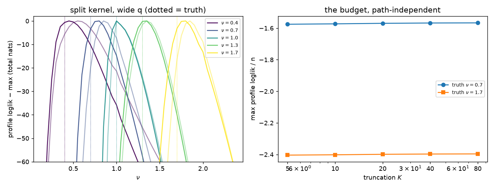

# 0006 — What the probes settle

Four probes ([`0002`](0002_is_nu_learnable.py), [`0003`](0003_one_coordinate_vs_p_free_ones.py),
[`0004`](0004_the_integer_part_must_be_exact.py), [`0005`](0005_the_q_ridge.py)),
two of which existed mainly to catch defects in their predecessors. The final
numbers are 0005's; everything superseded is marked below rather than deleted.

Setup common to all: type-II fractional data $(1-B)^{\nu}x=w$, $Q=1$,
measurement noise at $\kappa=0.5$, the likelihood is the parent's
`_face_profile` (the $s=0$ face, $\sigma^2$ concentrated out) with $\alpha$
pinned to the kernel map — the parent is called, never copied.

## 1. The headline: $\nu$ is an estimate with an error bar

The integer audit found $p$ learnable from below and blind from above. The
fractional coordinate is learnable **from both sides**: every profile has an
interior maximum with steep curvature in both directions, at every truth
tried, including truths well away from any integer
(0005-A, $n=1500$, $K=25$, split kernel, wide-$q$ profile):

| truth | $\hat\nu$ (seed 0 / 1) | SE |
|---|---|---|
| 0.4 | 0.457 / 0.564 | 0.05 |
| 0.7 | 0.787 / 0.867 | 0.03 |
| **1.0** | **1.027 / 1.040** | 0.02 |
| 1.3 | 1.334 / 1.360 | 0.03 |
| 1.7 | 1.786 / 1.851 | 0.03 |

**The parent is recovered on the parent's own data** — random-walk series
profile to $\hat\nu\approx1.03$ — and the seed-to-seed scatter is now the
same order as the curvature SE (six seeds at truth 0.7: mean 0.792,
SD 0.053). The residual bias is upward, $+0.03$ to $+0.17$ across cases
(at truth 0.7, six-seed mean $+0.09$ — exactly what §3's $K$-sweep predicts
for $K=25$): truncation, quantified in §3, not an estimator defect — it
shrinks in $K$ on schedule.

## 2. Two structural lessons, both bought with a failure

**The integer part must be exact** (0004). The raw $K$-lag truncation of
the GL kernel has spectral radius $1+c/K$ for $\nu>1$ — slightly explosive —
so the likelihood pays $\sim n(r{-}1)$ spurious nats and the profile is
dragged toward the integer faces, which truncate exactly: truth 1.3 profiled
to $\hat\nu\approx1.06$ (0002-A), and the frozen kernel scored forward lost
**2.5 nats/point** at truth 1.7 (0003). Writing $\nu=m+f$ and composing the
**exact** integer factor with the truncated fractional one,
$\alpha = (1-z^{-1})^m * P_K^f$, makes the radius exactly 1 and repairs both:
$+0.05$ to $+0.38$ nats/point on the profiles, and the prequential
catastrophe becomes a win (§4). The map is still only a map — inheritability
(0001 §3) is untouched.

**The nuisance ratio must be scanned, not followed** (0005). The
$(\nu,q)$ surface carries two ridges about 2.5 log-$q$ units apart, and
0002/0004's warm-started $q$-search stayed on whichever ridge the sweep
entered. That produced 0004-B's likelihood *falling* as $K$ rose — the
signature of a missed optimum, since more budget cannot honestly buy a worse
one. A flat 27-point $q$-scan at every $\nu$ is path-independent, costs ~2×,
and restores monotonicity.

> **Withdrawn.** 0004-D reported the $\nu<1$ profile as bimodal (modes near
> 0.7 and 1.2) and blamed the seed scatter on mode-hopping. Under the
> path-independent profile **no second mode exists** on any of six seeds —
> the "modes" were the two $q$-ridges seen through a profiler that could not
> move between them. 0002-A's scattered $\hat\nu$ (1.204 at truth 0.7) and
> its claim that curvature SE understates the error by an order of magnitude
> are artifacts of the same defect and are superseded by §1's table.

## 3. The budget is honest, and it buys bias, not likelihood

0005-B, path-independent, seed 0:

| truth | $K{=}5$ | 10 | 20 | 40 | 80 |
|---|---|---|---|---|---|
| 0.7: ll/n | −1.5753 | −1.5728 | −1.5694 | −1.5675 | −1.5666 |
| 0.7: $\hat\nu$ | 0.945 | 0.874 | 0.806 | 0.754 | 0.722 |
| 1.7: ll/n | −2.4039 | −2.4019 | −2.3988 | −2.3970 | −2.3963 |
| 1.7: $\hat\nu$ | 1.948 | 1.875 | 1.805 | 1.753 | 1.719 |

Monotone in $K$ at both truths, so $K$ qualifies as a compute budget. Two
structure facts sit in this table:

- **The bias depends only on the fractional part.** Truths 0.7 and 1.7 share
  $f=0.7$, and their bias sequences are numerically identical
  (0.245/0.174/0.106/0.054/0.022 against 0.248/0.175/0.105/0.053/0.019) —
  the exact integer factor contributes none. Fitted decay $K^{-0.9}$, the
  order the tail law predicts.
- **The likelihood is nearly flat in $K$** (9 millinats/point from $K=5$ to
  80) **while the bias moves by 0.2.** So the budget's real product is an
  unbiased coordinate, not a better score — worth knowing before paying for
  $K$.

The open cost: the truncated fractional factor's missing tail weight is
$|\binom{f-1}{K}|\sim K^{-f}$, which is *large* for small $f$ — at $K=25$ it
is 0.035 for $f=0.7$ but **0.29 for $f=0.3$ and 0.83 for $f=0.05$**. Orders
just above an integer are badly represented at any affordable $K$; that is
the strongest argument for the quadrature-on-the-channel-density realisation
(0001 §5) and it is measured, not hypothetical.

## 4. One coordinate against $p$ free ones

Prequential, the repository's standard: fit on 800 points, score the log
predictive density of the next 800, parameters frozen, no complexity
penalty. FRAC is the split kernel with the wide-$q$ profile ($K=25$, one
dynamics coordinate); AR($p$) is the parent's own `_face_optimum` with
$\alpha$ free ($p$ dynamics coordinates). Mean over 3 seeds, nats/point,
Δ = FRAC − best AR (0004-C for truths ≤ 1, 0005-C above):

| truth | FRAC | best AR | Δ |
|---|---|---|---|
| 0.7 | −1.6073 | −1.6034 (AR4) | −0.004 |
| 1.0 | −1.6165 | −1.6180 (AR2) | +0.002 |
| 1.3 | −1.7079 | −1.7318 (AR4) | **+0.024** |
| 1.7 | −2.4532 | −2.5706 (AR4) | **+0.117** |

At and below the parent it is a tie — the extension is free where it is not
needed, the same property the ODE filter had to earn against the parent. At
genuinely fractional orders **one learned coordinate beats four free ones**,
and the margin grows with distance from the integer. The rounding cost is
not graceful either: a free AR(1) fitted to $\nu=1.7$ data is
catastrophically overconfident out of sample (−4.7 to −6.0 nats/point,
against FRAC's −2.4), because it commits to exponential decay of a process
whose memory is hyperbolic.

## 5. What this feeds back to the parent

Two concrete requirements on the parent's flagged rework, both discovered by
hitting them:

1. **Guards must reject on numerical overflow, not on spectral radius.**
   `_loglik_batch`'s $-\infty$-on-overflow guard is exactly right; a
   radius$\,\le1$ admissibility test added during a stability rework would
   silently exclude every raw-truncated kernel above $\nu=1$ — and, worse,
   would misfire on the *split* kernel too, because of the next item.
2. **Radius tests near multiple unit roots need multiplicity-aware
   tolerance.** The split kernel's radius is exactly 1, but `np.roots` on an
   $m$-fold root at 1 jitters by $O(\varepsilon^{1/m})$: measured
   1.000000031 at $\nu=2.3$ ($m=2$), which already fails the parent's
   $1+10^{-9}$ test in `Params.alpha_at`. Any inheriting layer should either
   pass the known factorisation down or the parent should loosen the
   tolerance to $\sim10^{-6}$.

Neither requires the parent to change today; both belong in the parent's
review whenever the stability rework happens.

## 6. What is not yet done

- All probes ran on the **face** (homoscedastic, $\sigma^2$ concentrated).
  The full filter — noise channels, dynamics channel, `fit_` — has not been
  run over a fractional kernel yet; nothing in the interface prevents it.
- **Composition with oscillatory modes** ($\alpha$ of
  $(1-z^{-1})^{\nu}a(z^{-1})$) is defined but unmeasured — that, not the pure
  integrator ladder, is the full replacement for integer $p$.
- $\hat\nu$ is currently an argmax. The repository's own architecture says to
  **grid $\nu$ and carry the posterior** — the same marginalisation `0039`
  demands for $s_P$, and the natural home for the degree-uncertainty error
  bar. One more gridded channel, at a filter pass per node.
- The quadrature realisation of the channel density (0001 §2/§5), which §3's
  small-$f$ tail numbers now actively motivate.
