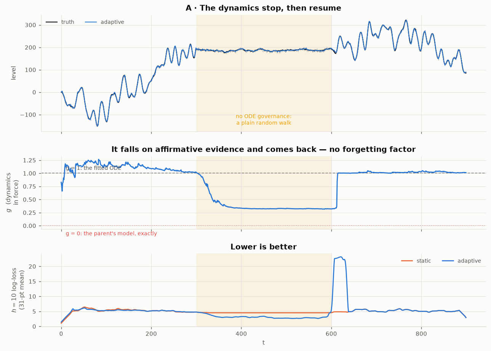
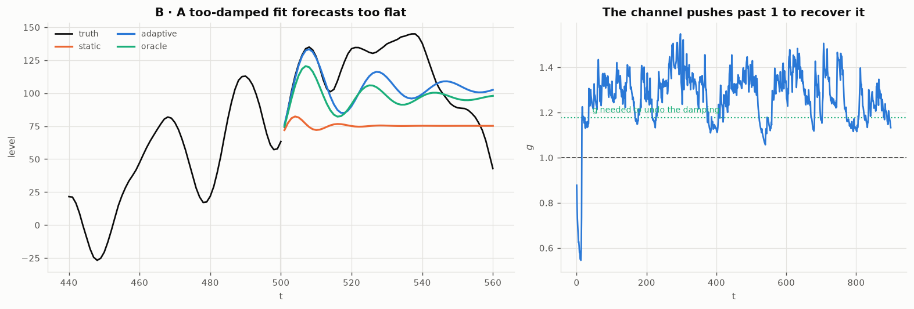
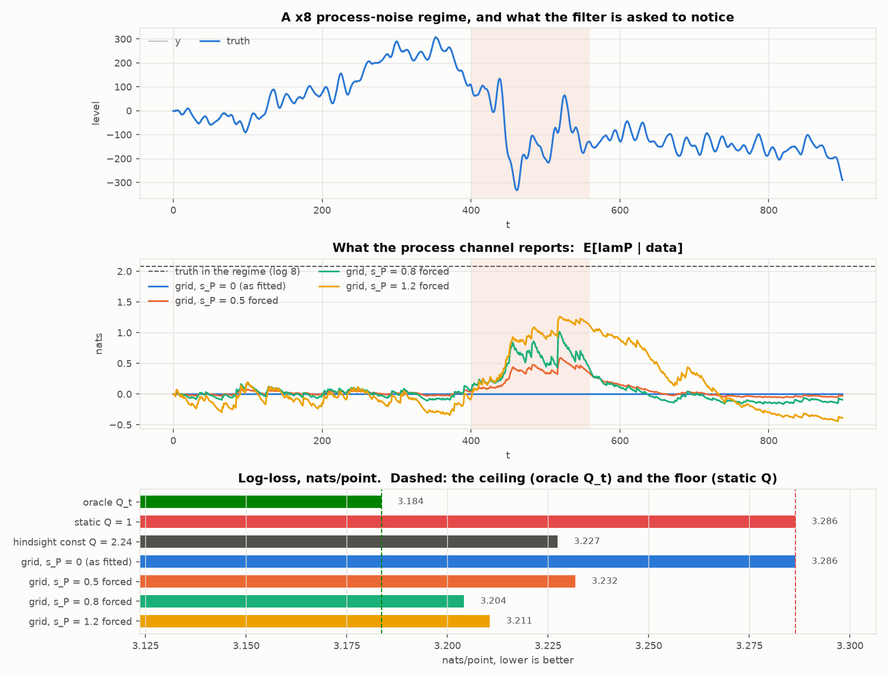
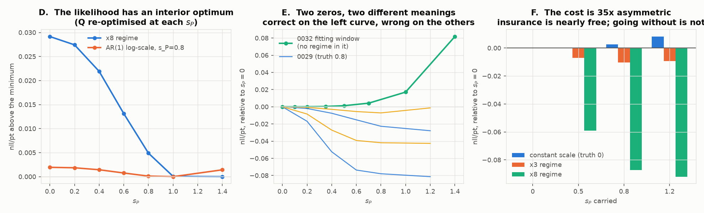

# Current state

Extending the parent filter from unbiased random walks to processes whose
evolution is locally a **second-order linear ODE in one variable with a constant
offset**. Same rule as the parent: no theoretically relevant free parameters.
Compute budgets are allowed, because a compute budget trades a real-world cost
against theoretical accuracy and nothing else.

**There is a candidate filter now**, in `output/odefilter/`. It reduces to the
parent exactly (checked to 1e-8, not asserted), and on the *stationary* target
class it forecasts **1.5–3.7× better** at short horizons while costing within
±5% on a plain random walk. On a series whose assumptions expire
mid-run its point forecasts are level with the parent's, but **its forecast
*distribution* is better by 0.289 nats/point** and it is calibrated where the
parent is 1.6–2.9× overconfident — see
[`0033`](exploration/0033_where_the_candidate_loses.md) for where it loses and
[`0036`](exploration/0036_three_corrections.md) for why MSE was the wrong lens. **`alpha` is estimated once and then tracked**, by a dynamics channel with the
parent's own model as an explicit member — see below. Twenty probes stand behind it — see
[`exploration/0027`](exploration/0027_the_candidate_filter.md) for what it
costs and what is deliberately left out. The parent workstream is untouched.

## The candidate

Forecast MSE against the fitted parent, 3 seeds, n = 900 (lower is better):

| data | $\kappa$ | $h{=}1$ | $h{=}5$ | $h{=}20$ |
|---|---|---|---|---|
| **ODE** (target class) | 0.25 | **0.273** | **0.457** | 0.885 |
| **ODE** | 1.00 | **0.663** | **0.616** | 0.914 |
| WALK (the parent's own model) | 0.25 | 0.996 | 0.983 | 0.954 |
| WALK | 1.00 | 1.005 | 1.013 | 1.054 |

**The gain decays with horizon exactly as the theory predicted before the filter
existed**: the oscillator's memory $1/(1-|z|)$ is 19.6 steps, so by $h=20$ only
the unit root remains — which the parent models too — and the advantage
vanishes. $Q$ is badly conditioned from moments (0.66% of $\gamma_0$,
amplification 151), so it is never believed from the moment identity.

**`fit()` is now ~5.5× faster and no less accurate** — see
[the speedup](#the-speedup) below. **And the offset can now be linear**:
`fit(unit_roots=d)` pins $d$ roots at $z=1$ exactly, which is the only place a
climbing or declining bias can live and a place a free fit measurably misses —
see [*A climbing bias is a pinned root*](#a-climbing-bias-is-a-pinned-root).

## Symbols

**In the filter** — every one of these is fitted by maximum marginal likelihood:

| | meaning |
|---|---|
| $\alpha$ ($p$ of them) | the recurrence coefficients, $x_t=\sum_i\alpha_ix_{t-i}+w_t$. The roots of $z^p-\sum\alpha_iz^{p-i}$ are the ODE's modes |
| $Q,\ \sigma^2$ | *median* (geometric-mean) variance of process and measurement noise |
| $\lambda^P_t,\ \lambda^M_t$ | each channel's log-scale at $t$: $Q_t=Q e^{\lambda^P_t}$, $\sigma^2_t=\sigma^2e^{\lambda^M_t}$ |
| $\varphi_P,\ \varphi_M$ | **persistence** of each log-scale, in $[0,1)$. Near 0 the channel spikes; near 1 it drifts. Undefined when the corresponding $s$ is 0 |
| $s_P,\ s_M$ | **log-SD of each channel's scale** — the stationary SD of $\lambda^c$. $s_P=0$ means the process noise is homoscedastic; $s_P>0$ means its variance itself varies over time. This is the coordinate that says *whether there is any volatility structure at all*. $s_P$ is the least reliably estimated quantity in the filter: it lands on the $0$ boundary from local optima the likelihood does not endorse, and $0$ is an absolute claim rather than a small one ([`0039`](exploration/0039_two_zeros.md)) |
| $u$ | the injection direction, $z_t=Fz_{t-1}+u\,w_t$. **Currently pinned to $e_1$**, not fitted |
| $d$ (`unit_roots`) | how many roots are **pinned at $z=1$ exactly**, with only the quotient polynomial's $p-d$ coefficients fitted. $d{=}0$ (default) is the old free fit bit-for-bit; $d{=}1$ asserts the constant offset; $d{=}2$ the linear offset — a climbing or declining bias whose rate is a state. See *A climbing bias is a pinned root* below |

**Not in the filter** — analysis coordinates from the drift-law thread
(`0011`, `0015`–`0020`), which asked whether $\alpha$ should be allowed to
*move* and was largely refuted:

| | meaning |
|---|---|
| $\Sigma_{\text{drift}}=\nu^2R(\psi)\,\mathrm{diag}(\tau,1/\tau)\,R(\psi)^\top$ | the covariance of a hypothetical random walk on $\alpha$ itself |
| $\nu$ | its overall scale |
| $\tau$ | its **anisotropy** — how much more $\alpha$ is allowed to move along one axis than the other. Determinant held fixed, so $\tau$ is pure shape |
| $\psi$ | its **orientation** — the angle of that ellipse in $\alpha$-space. *Which direction* the dynamics are allowed to drift in |

**$s_P$ and $\psi$ are not siblings.** $s_P$ is a fitted parameter of the
shipped filter and describes how much the *noise* varies. $\psi$ is a
coordinate of a proposed law for how the *dynamics* wander, it is not in
`core.py`, and the law it belongs to lost its minimax argument in `0013`. Both
were measured estimable; only $s_P$ is used.

Elsewhere: $\kappa=\sigma/\mathrm{SD}(\Delta x)$ is the noise level the probes
sweep, $q=Q/\sigma^2$ the parent's signal-to-noise ratio, $\rho_1$ the process's
lag-1 autocorrelation, $\Gamma$ the Fisher information on $\alpha$, and
$\eta=(Q_{\text{eff}}-Q)/Q$ the relative noise floor from not knowing $\alpha$.

## The free-variable audit

Full ledger in [`exploration/0030`](exploration/0030_the_free_variable_audit.md),
probes in [`0028`](exploration/0028_the_free_variable_audit.py) and
[`0029`](exploration/0029_the_phi_start.py). Every constant in `core.py` sorted
into four kinds — **4 commitments, 5 scaffolding, 3 budgets, 5 guards** — and
the scaffolding then *measured* rather than argued about.

**Three commitments bind at the defaults, and $p$ was only one of them.** The
other two were never written down: the injection direction is pinned to
$u=e_1$ ($p-1$ numbers, inside the $2p+1$ identifiable budget — this is the gap
`0001` §3 recorded without naming), and $\alpha$ is static.

**$p$ is learnable from below.** Prequential log-loss — fit on the first half,
score the log predictive density of the second, no complexity penalty, because
AIC's 2 or BIC's $\log n$ would each import a free parameter into the very
question being asked:

| data | $p{=}1$ | $p{=}2$ | $p{=}3$ | $p{=}4$ | $p{=}5$ | verdict |
|---|---|---|---|---|---|---|
| ODE | −3.525 | −3.253 | **−3.122** | **−3.121** | **−3.124** | $p\ge3$ |
| WALK | **−2.679** | −2.681 | −2.683 | −2.682 | −2.681 | $p{=}1$ |

The rule **recovers the parent on the parent's own data**, and climbs 0.40
nats/point from $p{=}1$ to $p{=}3$ on ODE data before going flat within noise.
So it pins a floor and is nearly blind above it. That is enough: $p$ is a
categorical axis with a short useful range, and the worst case is to run
several orders in parallel and let each one's tracked predictive likelihood
say which fits — the same grid-the-nuisance architecture the filter already
uses one level down. The continuous version (fractional order, learned as a
coordinate) is recorded in the [repository README](../README.md#open-directions).

**Two corrections fall out, and the first is now applied.** The $Q$ scan
(stage 1b) is inert across a $10^6$ window and *removable* — every variant that
moves the start beats the default by the same 0.09 nats, so it reliably starts
the search slightly worse than the closed form it was added to fix, at a cost
of 13 filter passes. It is gone: pass 1 of the new `fit_` computes the same
quantity exactly. And
`_iv_alpha` should **require** $m>p$ rather than default it: at the
just-identified $m=p$ the fit diverges ($\hat Q = 409$ against a truth of 1),
while $m=2p$ and $4p$ agree to 0.003. That is a precondition, not a dial.

**One negative result worth keeping.** The $\varphi$ start is inert, but only
because $\hat s_P\to0$ on every dataset tried — including data generated with
$s_P=0.8$. The parent's missing 5×5 $\varphi$ grid is therefore still a real
gap; it cannot be exercised while $\hat s_P$ is pinned at zero.

> **Superseded.** This section used to explain that zero as a conditioning
> fact — "$Q$ is 0.66% of $\gamma_0$, so a log-scale wobble barely moves the
> predictive variance that $\sigma^2$ dominates", the same fact as the 151×
> amplification in `_moment_noises`. [`0039`](exploration/0039_two_zeros.md)
> shows that is the wrong currency and the wrong mechanism. $\gamma_0$ is not
> what the likelihood sees; $Q/S$ is, and forcing the channel on recovers 80%
> of an oracle's advantage. See *The process channel was never dead* below.

## The speedup

`fit()` is **5.5× faster** and **not worse on any case measured** — 5 series
types × 2 seeds, $n=400$, $p=3$, both parameter vectors scored with the *old*
implementation's likelihood so the new evaluator cannot flatter itself.

| | old | new | Δ log-lik/point |
|---|---|---|---|
| ODE, $\kappa=0.25$ | 44–60 s | 6–8 s | 0.0000 |
| ODE, $\kappa=1.0$ | 58–60 s | 8–9 s | 0.0000 |
| ODE + 12% missing | 58–69 s | 6–7 s | +0.0001 |
| WALK | 53–59 s | 19–34 s | +0.0005, +0.0015 |
| ODE, $\alpha$ shifts mid-run | 69–326 s | 25–32 s | **+0.267, +0.106** |
| **total** | **856 s** | **155 s** | worse on **0/10** |

Everything rests on one measured fact: **the recursion is dispatch-bound, not
arithmetic-bound**, so $B$ parameter vectors cost far less than $B$ evaluations.
At $n=400$, $p=3$, order 5, one evaluation is 29 ms and a 19-row batch is 98 ms
— 3.4× for 19× the work. Every start screen and every gradient is therefore a
batch (`_loglik_batch`).

Three things changed, in decreasing order of what they bought:

1. **The $s=0$ face is solved directly.** With $s_P=s_M=s_A=0$ the grid
   collapses to one state and the model is an ordinary linear-Gaussian state
   space — a bare $p\times p$ Kalman filter. On it the recursion is homogeneous
   of degree 1 in $\sigma^2$, so $\sigma^2$ **concentrates out in closed form**
   and only $(\alpha,\log q)$ with $q=Q/\sigma^2$ is searched. That face is
   3.1 ms per evaluation against 29 ms for the grid, and it is where the old
   stages 0, 1b and 2 all lived — paying the full $\text{order}^2$ grid for a
   face on which the grid is one point repeated.
2. **The subspaces are split by conditioning, not by convenience.** $\alpha$'s
   curvature is orders of magnitude from $\log Q$'s, and pass 1 has already put
   $\alpha$ at its exact face optimum, so pass 4 optimises the six noise
   coordinates *before* touching $\alpha$; likewise $(\varphi_A,s_A)$ before the
   full nine. This was worth **2.2× → 5.5× on its own** — the single largest
   factor, and the one that was not obvious in advance.
3. **L-BFGS-B with a batched central-difference gradient** replaces Nelder-Mead,
   which needed ~500 function values per start.

**A quality result fell out of it.** On the $\alpha$-shifts probe the old staged
Nelder-Mead wandered out of the unit disc and returned an **explosive**
$\alpha$ (spectral radius 1.509); the bounded search started from the face
optimum returns 1.012, and gains 0.267 nats/point doing it. The old fit was not
merely slower there, it was wrong.

**A negative result was recorded rather than hidden.** One or more streaming
(recursive prediction-error) passes after the start screen — the obvious way to
improve a start without paying for more likelihood evaluations — makes things
strictly worse, at every step size over four orders of magnitude. The start was
never the bottleneck; conditioning was. See
[`0039`](exploration/0039_the_online_pass_does_not_pay.md).

The **online filter is untouched by all of this**: `update`, `predict`,
`filter`, `_run`, `derivatives` and the grid builder are byte-identical, and
53k online observables agree bit for bit.

## The dynamics channel: `alpha` is tracked, not held

Acting on `0036` §1. The filter now grids a scalar $g$ on

$$\alpha(g)=(1-g)\,(1,0,\dots,0)+g\,\alpha,\qquad g\sim\mathrm{AR}(1)(\varphi_A,s_A)$$

with $\varphi_A$ and $s_A$ **learned by the same marginal likelihood as
everything else**. $g=1$ is the fitted dynamics; **$g=0$ is exactly the parent's
local-level model**, so "the dynamics have stopped governing" is a member of the
family with its own likelihood rather than an absence of evidence; $g>1$ is more
persistent than fitted. `Step.dynamics` reports the posterior mean of $g$. With
$s_A=0$ the channel collapses to one node and the recursion is bit-for-bit what
it was before — the parent-reduction test is unchanged.

**It reverts, with no forgetting factor anywhere.**
[`0037`](exploration/0037_the_dynamics_channel.py) runs ODE → flat → ODE:

| segment | $\hat g$ | log-loss change | calib. static | calib. adaptive |
|---|---|---|---|---|
| ODE | 1.113 | −0.074 | 1.56 | **0.99** |
| **flat** | **0.329** | **−1.561** | 0.05 | **0.88** |
| ODE again | 1.019 | +0.001 | 1.50 | 1.42 |

$g$ falls from 1.1 to 0.33 within about 30 steps of the dynamics stopping, sits
there, and returns to 1.0 within a step of their resuming. **The honest caveat
is in the bottom panel**: the return costs a transient log-loss spike, because
the filter had genuinely committed to flat. That spike is why "ODE again" is a
wash rather than a win — the gain is real only where the model was actually
wrong.

**And it fixes the too-flat forecast.** Given a deliberately over-damped
$\alpha$ (oscillator 0.875 against a true 0.949):

| filter | $\hat g$ | log-loss | calibration |
|---|---|---|---|
| static | 1.000 | 6.997 | 6.04 |
| **adaptive** | **1.283** | **5.582** | **1.01** |
| oracle (true $\alpha$) | 1.000 | 5.330 | 1.08 |

**85% of the static-to-oracle log-loss gap closed**, and calibration goes from
6.04 — badly overconfident — to 1.01. The static filter's forecast flattens
within a few steps; the adaptive one carries the oscillation.

$g$ is one scalar along one direction: it says how much of the fitted departure
from flat is in force and **cannot express a change of frequency**. That is the
next axis.

## The process channel was never dead

[`0039`](exploration/0039_two_zeros.md), from
[`0038`](exploration/0038_why_the_process_channel_is_dead.py). This went looking
for the fix the list below called item 0a and found that every load-bearing
clause of the diagnosis was wrong.

**The channel works.** Its leverage is $Q/S$ — `share_process`, which the
filter already reports — not $Q/\gamma_0$. That is 0.033 on ODE data against
**0.080 on the parent's own random-walk data**, where the same channel works
fine: less, not none. Forced on against a ×8 process-noise regime, scored
against a Kalman filter told $Q_t$ exactly:

| filter | nll/pt | calibration | gap closed |
|---|---|---|---|
| oracle $Q_t$ | 3.1836 | 0.987 | 100% |
| static $Q$ | 3.2864 | 1.317 | — |
| best constant $Q$, in hindsight | 3.2274 | 0.972 | 57.4% |
| $s_P=0$ (as fitted) | 3.2864 | 1.317 | **0.0%** |
| $s_P=0.8$ forced | 3.2041 | 1.036 | **80.0%** |

**The two zeros meant different things.** `0032`'s is *correct* — its fitting
window contains no process-scale variation, and the likelihood there is
monotone increasing in $s_P$ from 0. `0029`'s is *not* — its data was generated
with $s_P=0.8$ and the likelihood's argmin lands on the truth.

**Four candidate causes, all measured, none of them it.** The GPB1 collapse
does delete 75% of the $Q$-vs-$8Q$ discrimination at this SNR (a real
architectural tax, and the honest argument for per-node covariances) — but what
survives is enough for the 80% above. The likelihood has an interior optimum
whenever $Q$ is free to move with $s_P$. The search is not at fault: the
profile taken *at the fitted parameters* has its argmin at 0, so the fit sits
at a genuine local optimum, and three search repairs change nothing. Nor is the
evidence short: doubling $n$ rescues nothing in three of four cases. The
boundary is **self-confirming** — wherever the fit lands on zero, the profile
taken from that point endorses zero; where it escapes, the profile follows it
out. And the fix this
document used to propose — parameterising on $Q_{\text{eff}} = Qe^{s_P^2/2}$ to
decouple $s_P$ from the mean process variance — **moves the argmin the wrong
way** on the impulsive case and flattens the penalty for being wrong sevenfold
on `0032`'s window.

**What is actually wrong** is decision-theoretic, not statistical. Carrying
$s_P=0.8$ costs **+0.0025 nats/pt** when unnecessary and saves **+0.0872** when
it is not — an asymmetry of **35×** — and the likelihood is nearly flat on the
cheap side (+0.0004 at $s_P=0.35$ on `0032`'s own window). $s_P=0$ is not "a
little scale variation"; it is the claim that the process variance is constant
*and always will be*. Everywhere else this filter integrates a nuisance out
over a grid — that is what $\lambda_P$, $\lambda_M$, $\lambda_A$ *are*. $s_P$
is the one place a point estimate is plugged in, and it is exactly where the
plug-in is least defensible.

No fix is shipped, because every candidate tested either did nothing or made it
worse. But the target is now quantified, which it was not before: **any repair
must beat 0.0025 nats/pt of premium against 0.0872 of exposure, and leave
`0032`'s window no worse than +0.0004.**

## A climbing bias is a pinned root

[`0041`](exploration/0041_a_climbing_bias_is_a_pinned_root.md), from
[`0040`](exploration/0040_can_it_find_a_climbing_bias.py). Acting on
[`crypto-predictivity/0016`](../crypto-predictivity/SUMMARY.md), which measured
a linear offset worth up to +0.027 nats/bar by differencing and left
first-class support as this filter's call.

The model has no intercept, so a climbing or declining bias can only live in a
**double root at $z=1$** — and the free fit cannot hold a root there. Its ML
unit root lands at $1\pm\varepsilon$, $\varepsilon=O(1/n)$ (measured
1.0011–1.0069 on drifting data, both sides on flat data), and a root is an
exponent: $1+\varepsilon$ renders an *additive* climb as *geometric growth of
the level*, overshooting at $h{=}20$ by more than a flat forecast undershoots;
$1-\varepsilon$ decays it. Underneath is an invariance of the parent's own
kind: within this family, forecast equivariance to $y\mapsto y+c$ **is**
$\sum\alpha_i=1$, and equivariance to $y\mapsto y+rt$ is the double root. A
free ML fit always trades that symmetry for in-sample density.

**`fit(unit_roots=d)` buys it back by construction**: the characteristic
polynomial is written $(z-1)^d(z^m-\sum\beta_jz^{m-j})$ and only the quotient
is searched — an exact linear map, $d{=}0$ bit-for-bit the old fit,
$p{=}1,d{=}1$ exactly the parent. Prequential, 3 seeds:

| data | free | pinned | pin − free, nats/pt |
|---|---|---|---|
| walk + drift (A) | bias(h=20) **−6.6 to −13.2** | bias **≈ 0** | **+0.052** |
| in-class $(z-1)^2{\times}$osc (B) | RMSE(h=20) 2448 | RMSE **534** | **+0.62** |
| trend over *integrated* osc (C) | — | $\hat Q$ inflates 8–42× | **−0.14** |
| no climb, wrong pin $d{=}2$ (D) | — | — | **−0.148** |
| no climb, right pin $d{=}1$ (D) | — | — | **+0.0003** |

The right pin is free, the wrong pin is expensive but **loud** — three orders
of magnitude above the ±0.0004 resolution `0039` set for this criterion — and
the prequential density **chose correctly in every section**. On in-class data
the anchor does nearly all the work: with one root pinned the free part lands
its own root at 0.995–1.001 (crypto's `diff_p3` behaviour), and the second pin
is free. The pinned fit recovers the quotient cleanly ($|z|=0.94$–0.96 against
0.949, $\hat Q\approx1$, $\hat\sigma^2\approx9$ — now a slow test). And the
internal pin **beats the differencing recipe that motivated it** by +0.036
nats/pt pooled: differencing turns iid measurement noise into an out-of-class
MA(1); pinning leaves it alone.

The recorded failure mode (C): when the pinned class is wrong the damage lands
in $\hat Q$ and long-horizon variance, not in a subtle bias. And the standing
limit: process noise still enters through $u=e_1$ alone, so a pinned slope
*wanders* with the same $Q$ that drives everything else — a deterministic
slope over in-class noise is inexpressible at any $d$, which is the $u=e_1$
commitment (`0030`) with a concrete casualty.

## Three corrections — read these before anything else

[`0036`](exploration/0036_three_corrections.md), from three objections that all
stood up.

**1. `whiteness` is the wrong instrument, and no forgetting factor is needed.**
A flat regime is not the absence of an ODE: $\alpha=(1,0,0)$ has roots
$\{1,0,0\}$ and *is* the parent, sitting inside the $p=3$ family. So "the
dynamics stopped governing" is a hypothesis with a likelihood and the data
affirms it. A cumulative residual autocorrelation cannot represent that; a
posterior over $\alpha$ candidates can, and reverts on its own. The forgetting
rate is then the kernel of that posterior — which is $\varphi$, already learned
(`0012` recovered $\hat\varphi_A=0.972\pm0.010$). **The fix is to make
$\alpha$ a gridded channel with FLAT as an explicit member**, which also
subsumes the parallel-orders idea. `whiteness` stays as a cheap smoke alarm.

**2. Scoring forecasts by MSE was wrong, and it reversed the headline.**
Decomposing the log predictive density into calibration $E[e^2/S]$ (1 = honest)
and sharpness:

| phase | log-loss diff | calib. ode | calib. parent | MSE ratio |
|---|---|---|---|---|
| baseline | **−0.544** | **0.96** | 2.69 | 0.662 |
| kicks | **−0.522** | **1.11** | 2.88 | 0.794 |
| meas. regime | **−0.284** | **0.86** | 1.57 | 0.608 |
| $\alpha$ jump 1 | +0.397 | 0.19 | 0.30 | 1.365 |
| proc. regime | +0.026 | **0.88** | 1.18 | 1.237 |
| $\alpha$ jump 2 | **−0.375** | 5.22 | 6.11 | 1.042 |
| **all** | **−0.289** | 1.76 | 2.82 | 0.999 |

By MSE odefilter was level overall; **by log-loss it is better by 0.289
nats/point** and better in four phases of six. odefilter is calibrated where its
model holds; **the parent is 1.6–2.9× overconfident nearly everywhere**. After
the second jump the two disagree explicitly — worse point forecast, better
distribution. Wrong-and-humble beats wrong-and-certain, and only the log score
says so. On the *filtered state* the parent's $\hat\sigma^2$ collapses to
$\approx0$, giving a calibration of $3\times10^6$: its point estimates are fine
and its uncertainty is meaningless. **Everything scored by MSE in this
workstream should be re-read, starting with `0026`.**

**3. State estimation is at the information bound; the lag is elsewhere.**
Exact KL between members of the family (with the prior stated on the
derivatives, because a diffuse prior makes the answer diverge — correctly). At
noise twice a velocity step: VELOCITY vs FLAT in 5/6/7 points for 1/3/5 nats,
ACCEL vs VELOCITY in 5/6/7, **ODE vs FLAT in 4/5/5**. The filter's own posterior
reaches 10% of steady state in **4 points**. So:

| | latency |
|---|---|
| state estimation, $\alpha$ known | **~4 points — at the bound** |
| $\alpha$ estimation | hundreds (the fit) |
| noticing $\alpha$ changed | never resolves |

Acceleration costs *no* extra points once the process is stochastic: its smaller
amplitude (SD 2.34 vs velocity's 6.74, the 2–3× factor) is cancelled by its
signature being integrated more times before reaching the observation.

## Where it loses — read this before quoting the battery

[`0033`](exploration/0033_where_the_candidate_loses.md) runs both filters over
one series carrying three impulsive kicks, a measurement-noise regime, a
process-noise regime and **two jumps in $\alpha$**, fitted on clean history
only. **odefilter is not better overall on it**: 1.35× *worse* tracking, level
(0.999) forecasting.

| phase | tracking | $h{=}10$ forecast |
|---|---|---|
| baseline | **0.673** | **0.662** |
| three kicks | **0.709** | **0.794** |
| measurement regime ×6 | **0.468** | **0.608** |
| after $\alpha$ jump 1 | **0.597** | 1.365 |
| process regime ×8 | **4.941** | 1.237 |
| after $\alpha$ jump 2 | 1.944 | 1.042 |
| **all** | **1.350** | 0.999 |

Two losses, both diagnosed. **$s_P$ fits to 0**, so when process noise goes up
8× there is no channel to say so and the *measurement* channel absorbs it
instead — a 4.9× regression. (This was written up as "the process-scale channel
is dead", caused by the $\gamma_0$ conditioning fact.
[`0039`](exploration/0039_two_zeros.md) refutes both halves: the channel works
when switched on, and the zero here is **correct** — this filter was fitted on
$t<620$ and the ×8 regime is at $t\in[720,850)$, outside the fitting window
entirely. The 4.9× is an out-of-sample failure, not a channel failure.) And
**after a jump in
$\alpha$, forecasting flips to worse**: a confident wrong model loses to a vague
one, which is the price of the "static $\alpha$" commitment. `whiteness`
correctly ignores all five non-dynamics events and fires on both jumps — slowly,
and without ever coming back down, which is what having no forgetting factor
costs.

`0026`'s 1.5–3.7× is not wrong, it is narrow: it measured a stationary target
class, and nothing before `0033` asked what happens when the assumptions expire
mid-series.

## The gut check

[`0031`](exploration/0031_what_the_two_filters_believe.py) puts both filters on
one series and draws what each believes, laid out so it cannot flatter the
candidate.

**A is the control.** Tracking error is nearly blind to the dynamics (`0006`),
so two filters that disagree about the model should still agree about where the
level is — and they do, almost everywhere. If the candidate looked much better
here, something would be wrong.

**B is the argument in one frame.** The parent's forecast is flat, because a
random walk's optimal forecast *is* the last level. The candidate carries the
oscillation forward and decays toward the same place over its 18-step memory
($|z|=0.944$). At this origin — fixed in advance, not chosen — the series then
runs away upward and both are wrong, which is what **C** is for: $h=20$ MSE
1216 against 1319, ratio 0.92, with the two error traces strongly correlated
because at that horizon most of what remains is the unit root, which both
model. The advantage-decays-with-horizon law, one series at a time.

**D has no parent analogue.** The velocity posterior tracks the true derivative
closely, the acceleration posterior is mostly band — and no finite difference
is ever formed, because this is the same state in a different basis.

## The model, and why it is the parent's

The solution space of $\ddot x + p\dot x + qx = r$ is
$\mathrm{span}\{1, e^{\lambda_1 t}, e^{\lambda_2 t}\}$, so a uniformly sampled
solution is annihilated by $(z-1)(z-z_1)(z-z_2)$:

$$x_t=\sum_{i=1}^{3}\alpha_i x_{t-i}+w_t,\qquad y_t=x_t+v_t$$

**The constant offset is a root at $z=1$**, not an extra state and not a pinned
"1" in the measurement array. It costs one order like any other mode, it carries
uncertainty automatically, and it makes the parent workstream this filter's
$p{=}1,\ \alpha{=}1$ face — the extension is strict in the literal sense.

The state is the **lag** vector $(x_t,x_{t-1},x_{t-2})$, not a derivative vector.
The two are related by a fixed invertible integer matrix, so they carry the same
information; the derivative-accuracy-versus-noise tension that the previous
construction paid for is a property of point estimates and disappears when the
full posterior is carried. Report in whichever basis the caller wants.

Identifiable content, $p=3$: **5 numbers** ($\alpha$, $Q$, $\sigma^2$) against
16 in an unstructured $(A,Q,C,R)$. Estimating a full $N\times N$ transition with
a full $N^2\times N^2$ covariance, as the previous construction did, is
over-parameterised by an order of magnitude.

## What is settled

Detail and numbers in [`exploration/0007`](exploration/0007_what_the_probes_settle.md).

**1. Errors-in-variables deletes the oscillation; it does not merely attenuate
it.** Least squares on observed lags loses the complex root pair outright from
$\sigma/\mathrm{SD}(\Delta x) = 0.25$ upward — a lightly damped oscillator is
read as over-damped relaxation. Since the oscillation carries the multi-step
predictability, this is the mechanism behind "tracks well, forecasts a few
steps".

**2. Lagging by more than the order annihilates the measurement noise, exactly.**
$\mathbb E[y_{t-k}(y_t-\sum_i\alpha_iy_{t-i})]=0$ for all $k\ge p+1$, for every
$(Q,\sigma^2)$, without stationarity. The exact analogue of the parent's
"increments annihilate the level".

**3. But instrumental variables is the anchor, not the estimator.** Against
exact ML with the noises known, IV is 4.0× / 6.2× / 28.8× worse in RMSE of
$\hat\alpha$ at $\kappa = 0.25/0.5/1$. ML's error is flat in $\kappa$; IV's is
not. IV's role is the parent's variogram identity: a closed-form consistent
start for the likelihood search.

**4. Uncertainty in the dynamics is exactly a process-noise term.** Verified to
1.27 Monte Carlo SE:
$$\mathrm{Cov}[z_t]=FPF^{\top}+e_1e_1^{\top}\big(Q+\hat z^{\top}\Sigma\hat z+\mathrm{tr}(\Sigma P)\big)$$
It enters through $e_1e_1^\top$ — the same channel as the process noise — so
$Q_{\text{eff}} = Q + \hat z^\top\Sigma\hat z + \mathrm{tr}(\Sigma P)$, and
$\eta = (Q_{\text{eff}}-Q)/Q$ is a third dimensionless number beside the
parent's $q=Q/\sigma^2$. Not knowing the dynamics is a fixed **relative** noise
floor where process noise is a fixed **absolute** one. Gridding $\alpha$ and
collapsing the level (GPB1) produces the identity for free — it describes what
the parent's own architecture already does, one level up.

**5. $\alpha$ is a forecasting parameter, not a filtering parameter.** Tracking
MSE is nearly blind to it (allowing drift buys $\le1.3\%$); $h$-step forecast
MSE is not (0.76–0.88 at $h{=}20$). **No comparison in this workstream may be
made on tracking error.** The horizon over which $\alpha$ matters is
$h\sim1/(1-|z|)$ — which is the "few steps of predictive power" of the previous
construction, with a number attached.

**6. The parent's architecture transfers.** Grid the nuisance, run the
conditional Kalman recursion, collapse the level, choose the volatility by
marginal likelihood. Measured at $p=1$: **68–83% of the static-to-oracle
forecast gap closed** on regime shifts in $\alpha$, and **exactly free**
(ratio 1.000 to four figures) when the dynamics do not change. Reproduced at
$p=2$ on a 4356-node grid.

**7. Differencing costs a factor $(1-\rho_1)$ in signal-to-noise, exactly.**
$\mathrm{Var}(\Delta x)=2\gamma_0(1-\rho_1)$ against $\mathrm{Var}(\Delta v)=2\sigma^2$.
So the parent's "work in increments" and this workstream's "work in levels" are
the same principle at different smoothness: for a random walk $\gamma_0\to\infty$
and $\rho_1\to1$ together and differencing is free; for a lightly damped
oscillator the charge is $16.5\times$ and it is not. **Smoothness is where the
two workstreams first part company.** An earlier proposal here — instrument the
differenced series — is withdrawn on this basis; it is worse at every noise
level.

**8. "Is the offset constant?" is answerable, with no new machinery.** ML with
the root free against pinned at $z=1$: at a true unit root the extra parameter
buys $2\cdot\text{LLR} = 1.36\pm0.44$, exactly the $\chi^2_1$ null expectation,
and $\hat z_0 = 0.9992\pm0.0005$. At a true $0.98$ it buys $19.56\pm1.13$ and
recovers $0.9797\pm0.0011$. Pinning costs nothing when right and doubles the
coefficient error when wrong. The constant-offset commitment is a hypothesis,
not an assumption.

**9. The dynamics channel has the parent's structure, and its impulsive end is
something the parent cannot express.** Writing $\alpha_t = \bar\alpha+\delta_t$,
the deviation enters as $\delta_t^\top z_{t-1}$ — noise proportional to signal
power. So $\varphi_A\to0$ is **multiplicative noise** and $\varphi_A\to1$ is **a
change in the ODE coefficients**: one coordinate, two named ends, the parent's
structure one level up. The channel carries the same centre / magnitude /
persistence triple, $(\bar\alpha, s_A, \varphi_A)$, and $\varphi_A$ identifies —
$0.972\pm0.010$ against a truth of $0.99$, cleanly separated from a fitted
$0.19$ (median) at the impulsive end, with $\hat s_A = 0.119$ against $0.12$.

**But the persistence dial is a predictive-*variance* parameter and provably
cannot move the point forecast**: with $\delta$ white,
$\mathbb E[x_t\mid z_{t-1}] = \bar\alpha^\top z_{t-1}$ exactly. Measured
forecast-MSE ratios are $0.995$–$1.005$ everywhere, as the algebra requires.
This completes a three-way split — the state shows up in tracking error,
$\alpha$'s *level* in forecast-mean error, $\alpha$'s *persistence* in
calibration — each nearly invisible in the other two.

## The mode structure: the square becomes a prism

The parent's square was (process / measurement) × (impulse / regime), and its
process-anomaly corner never sat right — "the level jumped" and "a large
process-noise draw" are the *same event* at $p=1$. Writing the disturbance with
a direction, $z_t = Fz_{t-1} + u\,w_t$, explains it: $\alpha$ is the **poles**
and $u$ is the **zeros**, and $p=1$ admits no zeros, so the two descriptions had
no room to differ.

**The direction axis saturates the model rather than inflating it.** $u$ up to
scale is $p-1$ numbers, and $(p) + (p-1) + 1 + 1 = 2p+1$ — exactly the
identifiable content of a scalar-observed linear system. The gap `0001` §3
recorded as "a modelling commitment" *is* the injection direction.

At $p=3$ there are $p+1=4$ corners, ordered by how many integrations separate
the disturbance from the observation — and one scalar orders them, the lag-1
autocorrelation of the disturbance's innovation signature. That is the parent's
own differentiator ("does the next point agree with the crazy one?") turned into
a continuum:

| | MEASURE | POSITION | VELOCITY | ACCEL |
|---|---|---|---|---|
| integrations to $y$ | — | 0 | 1 | 2 |
| lag-1 autocorr of signature | $-0.368$ | $-0.053$ | $+0.426$ | $+0.788$ |

**The parent is the $p=1$ face**: MEASURE and POSITION, and nothing else.

Confusion ledger — exact linear algebra, no simulation; post-event points to
99:1 attribution for events carrying 8 nats of detection:

- **VELOCITY vs ACCEL: 4 points** ($\kappa{=}0.25$), 5 at $\kappa{=}1$. A force
  impulse against a force step — the new, affordable distinction the parent
  could not express at all.
- **ACCEL ≡ FORCING**: never separate, and share the autocorrelation statistic
  to three figures. So the model's current pin $u=e_1$ *is* the top-derivative
  corner, observationally. Four corners, not five.
- **POSITION ≈ MEASURE is the hard pair** (0.549 out of a possible 4; never
  reaching 99:1 within 24 points at low noise). This is
  [`filter-optimality-proof`](../filter-optimality-proof/SUMMARY.md)'s
  Proposition 1 reappearing — the same degeneracy that forced the class
  definition. Tied to the unit root, and it gets *easier* at higher measurement
  noise.

**Correction, from [`0023`](exploration/0023_the_difference_operator_is_the_ladder.py).**
Differencing is exactly the map $(F-I)$ on the direction space, plus a leading-edge
spike: $\Delta r(u) = u_1\delta + r((F-I)u)$, verified to $1.3\times10^{-14}$. It
annihilates the offset direction (the unit-root eigenvector), so **a measurement
outlier is exactly the first difference of an offset jump** — the parent's two
channels are two rungs of one ladder. But it does **not** carry ACCEL to VELOCITY,
and the alignment converges to $2/\sqrt{10}=0.632$ rather than to 1, so that is not
a discretisation error: the step does not exist.

**The channels are the roots of the characteristic polynomial, not the
derivatives.** $F$ has distinct eigenvalues, so $(F-I)$ is diagonal in the modal
basis and mixes every other. Decomposed over the roots by the amplitude each
contributes to the observation, POSITION *is* the offset eigenvector exactly,
VELOCITY is 94% the oscillator, and **ACCEL is a ~60/40 mixture at every pole
location tested** — not a corner at all. That explains the ledger measured before
the explanation: different modes separate in 2 points, ACCEL≡FORCING because both
are mixtures of near-identical composition, and POSITION≈MEASURE is hardest
everywhere.

So the extended object is **(root) × (persistence)**: one channel per root, with a
complex pair counting as one two-dimensional channel carrying an **amplitude and a
phase**. The parent is the one-root case. Phase is a coordinate with no parent
analogue and is unmeasured; persistence is still not crossed in.

**Order selection and channel count are the same question** — each root is a
channel, so "is it second order?" asks "how many channels are there?", and the
offset-root test above was already an instance of it.

An interactive version — drag the pole, watch the corners, signatures and
separability recompute — is
[`exploration/mode-structure.html`](exploration/mode-structure.html).

## The drift-law proposal, and its refutation

The parent forced its drift law with scale equivariance. $\alpha$ has no scale,
so the proposal was to replace it with Čencov: a drift law must not depend on
how the parameter is written down, the unique reparameterisation-invariant
metric is Fisher, hence $\Sigma_{\text{drift}}\propto Q\,\Gamma^{-1}$ —
computable online, and reducing to the parent's log-scale law exactly
($I(\log\sigma^2)=\tfrac12$ is constant).

| claim | status |
|---|---|
| reproduces the parent's log-scale law | **yes**, analytically |
| the volume warp helps | **no** — null at $p=1$, dilutive at $p=2$ |
| the anisotropy matters | **yes** — $\pm10\%$ forecast MSE, $\vert t\vert$ to 8.6 |
| uniformly better than isotropic | **no** — the sign flips with shift direction |
| better in the worst case | **no** — withdrawn on a proper direction sweep |

Swept over 12 shift *directions* at two base points, an isotropic drift wins on
the median (0.716 vs 0.398 interior, 0.648 vs 0.107 near the stationarity
boundary) and ties or wins on the worst case. **The Fisher shape concentrates
the drift into a narrow cone** — inside it, the best result measured anywhere
(0.929); outside, near-static. Concentrating without knowing the direction is
exactly what minimax penalises.

**Why the parent's argument works and this one does not.** Scale equivariance is
a symmetry *of the world* — nature is genuinely indifferent to metres versus
feet, so a law respecting it is not merely well-formed but true.
Reparameterisation invariance is a symmetry *of the notation*: nature is not
indifferent to whether we write the dynamics in lag coefficients or in damping
and frequency, and the Fisher metric does not know which is which. Being the
unique well-formed answer is not the same as being the right answer, and the
parent's success made that easy to conflate.

**So the metric on the dynamics is an open modelling degree of freedom that no
invariance principle closes, and the shape has to be learned** — by the same
marginal likelihood as everything else.

## Is the shape estimable? Yes — both coordinates, and not obviously worth it

Profiling the drift covariance $\Sigma(\nu,\tau,\psi)=\nu^2R(\psi)\mathrm{diag}(\tau,1/\tau)R(\psi)^\top$
(determinant fixed, so scale and shape are separate coordinates) against a
determinant-matched isotropic control gives **6.69 millinats/point against a
0.38 null floor** — a $17.6\times$ separation, and about **four times the
parent's $s_P$**, which the parent measured at 0.0017 nats/point and told
callers not to read. The magnitude $\tau$ is readable.

The orientation $\psi$ is readable too, over seven generating orientations
every profile argmax lands on one of the two nearest kernel nodes. An earlier
apparent failure was an artifact of profiling at $\hat\tau=8$ rather than at
$\tau=4$; it is withdrawn.

**What is not established is that any of it is worth learning.** Forecast-MSE
ratios sit at 0.994–1.003 throughout — which is also exactly what a
variance-side gain looks like under a loss that cannot see the variance (below).

**A structural fact that constrains all of this.** For $p=2$ the information
metric has condition number $(1+\rho_1)/(1-\rho_1)$: **its anisotropy *is* the
process's lag-1 autocorrelation**, the same $\rho_1$ that sets the differencing
cost. So an isotropic metric forces $\alpha_1=0$ — four samples per period —
where the process carries $4.8\times$ less information about its own dynamics
and allowing drift at all is *worse* than static ($-0.57$ millinats/pt against
$+3.58$ at a smooth base point, same kernels). **A process must be smooth for
its dynamics to be learnable, and smoothness is exactly what makes the metric
anisotropic.** A control experiment at an isotropic metric is therefore
impossible, not merely hard.

Direction matters enormously — headroom ranges over $14\times$ with a sign
change across drift orientations — but is *not* a function of alignment with
the metric's principal axis (two directions at equal angle differ $9.3\times$).
That law is refuted. The probable confound is that the sweep held
$\lVert\Delta\alpha\rVert$ fixed, and **Euclidean length is the wrong measure
of how much the dynamics moved; the information distance
$\Delta\alpha^\top\tilde\Gamma\Delta\alpha$ is.** So the Fisher metric returns
in a third role: not a law for how $\alpha$ moves (refuted), not a law for what
can be seen (refuted), but the right way to *measure* how far it has moved —
which is the one thing a metric is for.

## The loss

Fitting $\alpha$ removes the **biased** portion of the process variance; $Q$ is
the **unbiased** residue. The persistence dial splits the dynamics deviation the
same way — persistent is predictable and moves the mean, impulsive is
unpredictable and moves only the variance. The loss that scores both halves in
the model's own proportion is the predictive log-likelihood,
$-\log p = \tfrac12(e^2/S + \log S) + \text{const}$: squared error keeps the
first term and drops the denominator, which is exactly why it cannot see a
parameter living in $S$. It introduces **no free parameters** — it is what
`fit()` already maximises — and the last protocol choice, out-of-sample scoring,
is removable by accumulating the score prequentially, each point scored before
it is seen. (This does not touch `filter-optimality-proof`'s open log-loss/MSE
seam, which is about which loss defines optimality, not which can see a
parameter.)

## Next, in order

0. ~~**Make $\alpha$ a gridded channel with FLAT as an explicit member**~~ —
   **done**, see *The dynamics channel* above (`0037`). What is left of it: $g$
   is one scalar along one direction and cannot express a change of
   *frequency*, and the return from a reverted state costs a transient.
0a. ~~**Fix the process-scale channel** by parameterising on $Q_{\text{eff}}$~~
   — **diagnosed and rewritten**, see *The process channel was never dead*
   (`0038`/`0039`). The channel is fine; the proposed fix is measured and makes
   things worse. What replaces it: **stop plugging $s_P$ in.** Marginalise it
   the way every other nuisance in this filter is marginalised, rather than
   letting a point estimate land on an attainable boundary where the likelihood
   is flat to four decimals and the loss is 35× asymmetric. That is a real
   design change with a real compute cost and needs its own probe. It now has a
   scoreboard: beat 0.0025 nats/pt of premium against 0.0872 of exposure,
   without costing more than +0.0004 on `0032`'s window.
   > **Update:** [`filter-oracle-gap/0009`](../filter-oracle-gap/exploration/0009_what_the_fit_does_with_the_sharper_likelihood.md)
   > reached the same conclusion from the opposite direction and priced it:
   > Fisher information in $s_P$ vanishes at 0, so the *point estimate* is
   > ill-posed under any likelihood — IMM-ML reads 0.3–0.9 into kick-free
   > homoscedastic windows, GPB1-ML reports 0 next to three 6-SD kicks.
   > Marginalising is meaningful only over the IMM likelihood (the GPB1 one
   > is flat along the $Qe^{s_P^2/2}$ ridge and integrates to indifference),
   > so 0a and 0a′ are one design, not two.
0a′. **Per-node covariances for the noise channels (IMM in place of GPB1).**
   Independent of the above, and now quantified: the shared covariance deletes
   **75%** of the $Q$-vs-$8Q$ discrimination at $\sigma^2=9$, and the loss grows
   with measurement noise (11.7% kept at $\sigma^2=36$).
   > **Superseded — it is a correctness item after all.**
   > [`filter-oracle-gap`](../filter-oracle-gap/SUMMARY.md) measured that the
   > collapse leaves the likelihood **flat along the ridge
   > $Q e^{s_P^2/2}=\text{const}$** (relief 0.0022 nats/pt against 0.0101 with
   > per-node covariances, whose argmin sits on the generating $s_P$). The
   > self-confirming boundary of `0039`, the fitted 0% of the oracle gap, and
   > the fit's endpoint wandering between $\hat s_P=0$ and $\hat s_P=1.44$
   > across pipeline versions are all that one degeneracy. Forced-channel
   > extraction under IMM: 89.5% of the oracle gap against 80.0%, and nearly
   > flat across the forced $s_P$.
0b. **Two corrections the audit found, both small:** delete the $Q$ scan, and
   make `_iv_alpha` require $m>p$. Both make the filter simpler *and* faster.
1. **Act on `whiteness`** — `0033` gives it a target: 1.365 and 1.042 after the
   two jumps against a 0.662 ceiling. The filter already reports when `alpha` has stopped
   fitting and does nothing about it. Refitting or drifting on that signal is
   the cheapest real use of the drift work and needs no grid.
2. **Widen the battery** — more seeds, more pole locations, and a
   hindsight-tuned constant-gain baseline alongside the parent.
2a. **Cross the dynamics channel with pinned roots.** Every `0040` fit ran
   `dynamics=False`. `alpha_at(g)` preserves the $z=1$ root at every $g$ but
   the double root only at $g=1$ — the right semantics (a drift that can stop
   governing) — and `_radius`'s $1+10^{-9}$ tolerance sits below the
   $1\pm10^{-8}$ split of a numerical double root. Needs its own probe before
   `unit_roots` and the channel are used together.
3. **Cross persistence into the channel structure.** Every disturbance measured
   so far fires once. Same exact linear algebra as `0021`.
4. **Is the oscillator phase readable?** The coordinate with no parent analogue:
   excite at a grid of phases and measure pairwise separability.
5. **Free $u$ in the filter** and confirm the likelihood has $2p+1$ identifiable
   directions and no more — turning the count into a measurement.
6. **Redo the drift-direction sweep at constant Fisher length**, with generating
   orientations on the kernel nodes rather than between them — six of seven in
   the current sweep sit at exact midpoints.
7. **Re-score everything on log-loss** — `0026` first (`0036` §2 shows the
   headline can reverse). Then the shape and
   $\varphi_A$ under it. Both currently rest on in-sample nats, and both are
   variance-side effects that MSE provably cannot see.
8. ~~**Speed.**~~ — largely discharged; see [the speedup](#the-speedup). The
   grid is still the compute budget, and the residual cost is now concentrated
   in the one pass that has to carry the dynamics channel's grid.
9. **Learn $Q$ and $\sigma^2$ jointly with $\alpha$.** Every probe so far holds
   them at truth; the parent's `fit()` shows six parameters is already the hard
   part and this makes eight or more.
10. ~~**Order selection**~~ — *floor* discharged in `0030`; the ceiling is not,
    and the fractional-order generalisation in the
    [repository README](../README.md#open-directions) is the principled way to
    close it.

Standing caution across 3–6: everything about the direction axis and the drift
shape so far is about what is *distinguishable*, not about what tracking gains.
Estimable is not worth estimating until a forecast or a prequential score says
so.

## Layout

- `exploration/` — numbered, later is more recent.
  [`0001`](exploration/0001_the_frame.md) fixes coordinates, order and the
  offset. `0002`–`0006`, `0008`–`0010`, `0012`–`0013`, `0015`, `0017`–`0019`, `0021`, `0023`
  are the probes, each self-contained and runnable. Five prose files carry the
  argument in sequence: [`0007`](exploration/0007_what_the_probes_settle.md),
  [`0011`](exploration/0011_the_drift_shape.md),
  [`0014`](exploration/0014_the_channel_and_the_withdrawal.md),
  [`0016`](exploration/0016_bias_variance_and_the_shape_profile.md),
  [`0020`](exploration/0020_orientation_is_readable.md),
  [`0022`](exploration/0022_the_integration_ladder.md),
  [`0024`](exploration/0024_the_modes_are_the_channels.md),
  [`0027`](exploration/0027_the_candidate_filter.md),
  [`0030`](exploration/0030_the_free_variable_audit.md),
  [`0041`](exploration/0041_a_climbing_bias_is_a_pinned_root.md) — **start at
  `0027` for the filter, `0030` for the audit, `0024` for the mode structure,
  `0020` for the drift law**, `0033` for where it loses, `0041` for the
  pinned offset roots. [`0031`](exploration/0031_what_the_two_filters_believe.py)
  is the picture. Three of them withdraw a claim
  from an earlier one (`0007` §2, `0011` §3, `0016` §2); the withdrawals are
  marked in place rather than edited away.
  Figures and raw numbers in `exploration/figures/`.
- `output/` — the candidate: the `odefilter` package, its tests, and
  `pyproject.toml`. See [`output/odefilter/README.md`](output/odefilter/README.md).
  `pytest -m "not slow"` runs the fast subset.

Run a probe with `python exploration/000N_*.py` (numpy, scipy, matplotlib).
