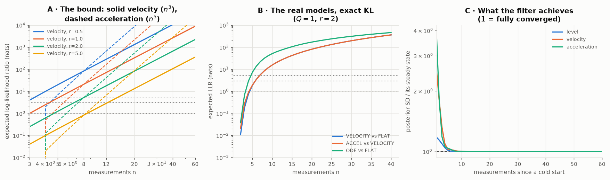

# 0036 — Three corrections: the diagnostic, the score, and the latency

Three separate objections, all upheld. Two of them change what the filter
should do; one changes how everything before it was measured.

## 1. Reversion is evidence, and `whiteness` is the wrong instrument

I framed `whiteness`'s failure to return to zero as needing a forgetting
factor, and then congratulated the design for refusing one. That was wrong in
both halves.

**A flat regime is not the absence of an ODE. It is a member of the family.**
$\alpha=(1,0,0)$ has roots $\{1,0,0\}$ — it *is* the parent's local-level model,
sitting inside the $p=3$ space. So "the dynamics have stopped governing" is a
hypothesis with a likelihood, and the data affirms it exactly the way it affirms
any other member. Nothing about it is an absence of evidence.

The reason my statistic could not express that is structural: a **cumulative
lag-1 autocorrelation of the residuals can only accumulate.** It has no
representation for "the evidence now favours a different member". A posterior
over $\alpha$ candidates does: it updates multiplicatively each step and reverts
the moment the likelihood ratio reverts.

**And then the forgetting factor is not a new free parameter, because it already
exists and is already learned.** The rate at which a posterior over models
forgets is the transition kernel of that model's indicator process — which is
$\varphi$, the same persistence coordinate the parent learns for its two noise
channels and that `0012` measured for the dynamics channel ($\hat\varphi_A =
0.972\pm0.010$ against a truth of 0.99). Grid the candidates, evolve them by a
learned-persistence kernel, weight by marginal likelihood. That is the
architecture already running one level down.

So the correct next step is not "add a half-life to `whiteness`". It is **make
$\alpha$ a gridded channel with a learned persistence, with FLAT as an explicit
member** — which is also, exactly, the parallel-orders mechanism from `0030` §6,
and it subsumes both.

`whiteness` keeps a smaller job: it is a cheap always-on residual check that
needs no grid, and it correctly fired on both $\alpha$ jumps and on none of the
five other events in `0033`. It is a smoke alarm, not a controller.

## 2. Forecasts are distributions; MSE cannot see them

`0033` scored forecasts by MSE. That was wrong by this workstream's own stated
standard, and wrong for a reason already written down in the parent's `fit_`
docstring about its `pem` criterion: squared error depends on the parameters
only through the predicted mean.

[`0034`](0034_score_the_distribution.py) rescores the same series, decomposing
the log predictive density into exactly the two things you asked to separate:

$$-\log p=\underbrace{\tfrac12\,e^2/S}_{\text{was it wrong}}+\underbrace{\tfrac12\log S}_{\text{how confident did it claim to be}}+\tfrac12\log2\pi$$

$\mathbb E[e^2/S]=1$ for an honest forecaster, whatever its accuracy.

### The $h=10$ forecast

| phase | log-loss ode | parent | diff | calib. ode | calib. parent | MSE ratio |
|---|---|---|---|---|---|---|
| baseline | 4.947 | 5.491 | **−0.544** | **0.96** | 2.69 | 0.662 |
| kicks | 5.024 | 5.546 | **−0.522** | **1.11** | 2.88 | 0.794 |
| meas. regime | 4.920 | 5.204 | **−0.284** | **0.86** | 1.57 | 0.608 |
| $\alpha$ jump 1 | 4.576 | 4.178 | +0.397 | 0.19 | 0.30 | 1.365 |
| proc. regime | 4.932 | 4.905 | +0.026 | **0.88** | 1.18 | 1.237 |
| $\alpha$ jump 2 | 7.107 | 7.482 | **−0.375** | 5.22 | 6.11 | 1.042 |
| **all** | **5.358** | 5.647 | **−0.289** | 1.76 | 2.82 | 0.999 |

**The headline reverses.** By MSE odefilter was level overall (0.999); by
log-loss it is **better by 0.289 nats/point**, and better in four phases of six.

**And the reason is the one you predicted.** odefilter is calibrated where its
model holds — 0.96, 1.11, 0.86, 0.88, essentially perfect — while **the parent
is overconfident nearly everywhere**, by 1.6× to 2.9× in $e^2/S$. It claims an
SD of 25.5 when the honest number is about 42.

The flip is explicit after the second jump: MSE ratio 1.042 (odefilter's point
forecast is worse) but log-loss −0.375 (its distribution is better). Both filters
are badly overconfident there — 5.22 and 6.11 — but odefilter is *less* so.
**Wrong-and-humble beats wrong-and-certain, and only the log score can say it.**

### The filtered state, same treatment

The 1.35× tracking loss deserved the same scrutiny, and it does not survive it.

| phase | calib. ode | calib. parent |
|---|---|---|
| baseline | **0.97** | $3.0\times10^6$ |
| kicks | **0.98** | $3.0\times10^6$ |
| meas. regime | 1.33 | $1.6\times10^7$ |
| proc. regime | **2.03** | $3.4\times10^6$ |
| all | **1.21** | $4.7\times10^6$ |

**The parent's fitted $\hat\sigma^2$ collapses to $\approx0$ on this data.** It
explains an oscillator as a very fast random walk with $\hat Q=67$, so it
believes the observations are noiseless and reports a posterior SD of 0.00 while
being off by about 3. Its point estimates are fine; its uncertainty is
meaningless. MSE would never have shown this.

odefilter's tracking calibration is 0.97–1.33 wherever its model holds, and
**2.03 in the process regime** — 2× overconfident, which is the dead $s_P$
channel of `0033` showing up in the second moment as well as the first.

**Everything in this workstream scored by MSE should be re-read.** `0026`'s
battery in particular.

## 3. The learning is not lagging — but something else is

[`0035`](0035_how_fast_can_it_know.py) computes what a bound actually is, three
ways.

**A. The clean bound.** Distinguishing a ramp from a constant in white noise,
the expected LLR is exactly $n(n^2-1)/(24r^2)$ nats with $r=\sigma/v$ the
noise-to-velocity-step ratio. At $r=2$ — your condition — velocity reaches 1 nat
at $n=5$, 3 nats at $n=7$, 5 nats at $n=8$.

**B. The real stochastic models.** Exact KL between members of the same
3-dimensional family. One thing had to be got right first: with a diffuse prior
the answer diverges — correctly, since an unboundedly large initial velocity is
unboundedly easy to detect — so the prior is stated on the derivatives and
parameterised by the same $r$. The level prior stays diffuse and is *provably*
harmless: every model here has a unit root, so $\sum\alpha_i=1$ and the constant
vector $(1,1,1)=D[:,0]$ is fixed by all four transitions alike. Measured: moving
it over $10^2$ changes the answer by 0.001 nats. As a check, $Q\to0$ reproduces
part A ($n=8$ against $n=7$).

At $r=2$, $Q=1$, nats $\ge$ 1 / 3 / 5:

| comparison | n |
|---|---|
| VELOCITY vs FLAT | 5 / 6 / 7 |
| ACCEL vs VELOCITY | 5 / 6 / 7 |
| **ODE vs FLAT** | **4 / 5 / 5** |

**Your velocity estimate was right**: accessible around 4–5, clear by 6, at
noise up to twice a velocity step.

**Your acceleration estimate was too pessimistic, and the reason is
interesting.** You expected 2–3× the points; it costs essentially nothing extra
once the process is genuinely stochastic. Two effects cancel. Acceleration's
amplitude is smaller — the ODE's own acceleration SD is 2.34 against a velocity
SD of 6.74, a factor 2.88, which is exactly the 2–3× you intuited and it *is*
priced in here. But process noise entering a higher derivative gets integrated
more times before it reaches the observation, which makes its signature *more*
distinctive, not less. In the deterministic limit acceleration does cost more
(8/11/12 against 6/8/9); with $Q=1$ the integration bonus cancels the amplitude
penalty.

**C. What the filter achieves.** From a cold start with true parameters, the
posterior SD reaches within 10% of its steady state in **4 measurements for
velocity and 4 for acceleration** — against a bound of 5–7. **The recursion is
not laggy. It is at the bound.**

So the lag is real but it is somewhere else, and this separates the three:

| | latency |
|---|---|
| **state** estimation, $\alpha$ known | **~4 points** — at the information bound |
| **$\alpha$** estimation | hundreds of points (the fit) |
| **noticing $\alpha$ changed** | never resolves — `whiteness` is cumulative |

The perceived lag is entirely in the second and third rows, and §1's gridded-$\alpha$
channel with a learned persistence is the same fix for both.

## Ordered consequences

1. **Make $\alpha$ a gridded channel with FLAT as an explicit member**, evolved
   by a learned-persistence kernel. Fixes reversion, replaces `whiteness` as a
   controller, and subsumes parallel-order selection.
2. **Fix the process-scale channel** (still, from `0033`) — now with a second
   symptom: 2.03 calibration in the process regime, not just 4.9× MSE.
3. **Re-score everything on log-loss.** `0026` first.
4. State-estimation latency needs no work. It is at the bound.
