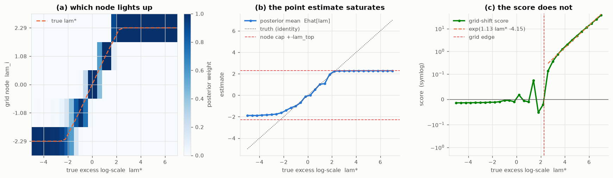
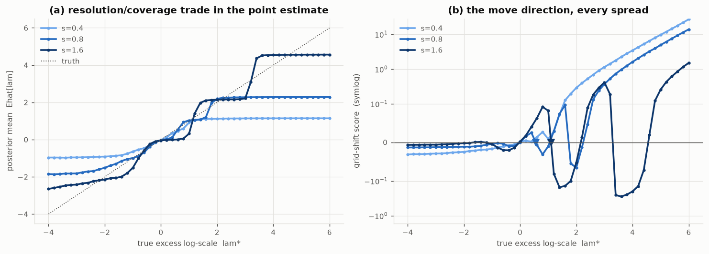

# 0002 — the direction that survives the edge

Reading of [`0001_what_lights_up.py`](0001_what_lights_up.py). One process
channel in isolation (s_M = 0), order 5, phi_P = 0.98, Q = s2 = 1. Data is a
random walk with a **constant** excess log-scale lam\* (step variance
Q·exp(lam\*)), observed with unit noise; lam\* is swept from inside the grid to
far outside it. The single-channel recursion is checked against the shipped
filter and agrees to 1e-7.

The question is the one a moving grid has to answer: **which way is the truth,
and can I tell even when it is off the grid entirely?**

> **⚖️ ATTRIBUTION —** _The grid-shift score is the score function (gradient of the marginal log-likelihood) of a Gaussian scale-family mixture; its slope-≈1 far-field log-linearity is elementary scale-family algebra (score grows like e^{lam*−lam_top}, so its log recovers the distance)._ Prior art: Fisher score / score-based estimation (standard); the moving grid of scale hypotheses is MMAE (Magill 1965) / moving-bank MMAE (Maybeck). Status: RECOMBINATION.

## Two reads of the same posterior

- **posterior mean** `Ehat[lam] = mean_t Σ_i π_i lam_i` — the obvious estimate.
- **grid-shift score** `g = mean_t Σ_i π_i · ½ (Qg_i/S_i)(e²/S_i − 1)` — the
  derivative of the per-step marginal log-likelihood with respect to rigidly
  sliding every node (`lam_i → lam_i + μ`, i.e. `log Q → log Q + μ`), holding
  the carried covariance and the prior mixture fixed. A cheap Fisher-scoring
  read on *which way this grid should move*.

Both are the natural output of the grid the filter already runs — no new state.

## Result 1 — the point estimate saturates; the score does not

Panel (a): the posterior weight profile tracks the truth node-for-node inside
coverage, then pins to the top node once lam\* passes it. Panel (b): `Ehat[lam]`
follows the identity through the interior and **saturates at the top node**
(2.282 against a cap of 2.286) — beyond the grid it reports the same number for
lam\* = 3 and lam\* = 7. It cannot name a distance it has no node for.

Panel (c): the grid-shift score keeps climbing. Far above the grid it is
log-linear in lam\*,

    log g = 1.13 · lam*  −  4.15         (fit over lam* > lam_top + 0.5)

with **slope ≈ 1** — the score grows like `exp(lam* − lam_top)`, so its log
recovers the overshoot distance up to a scale near one. Direction *and*
magnitude, read off a fully saturated posterior. (The intercept is not
`−lam_top`; it absorbs the ½ and the boundary node's gain `Qg_top/S_top`, which
the pre-run prediction ignored. The slope is the load-bearing claim and it
held.)

This is the signal the moving grid needs: **even when the true dynamics are
well outside the grid region, the score points at them and scales with how far
away they are.** The saturating posterior mean does not.

## Result 2 — between nodes, the signal has dead zones at wide spread

> **⚖️ ATTRIBUTION —** _Between-node "dead zones" and the overlap requirement are a grid/quadrature-resolution limit of a mixture: sparse nodes cannot resolve intermediate scales, and the (Qg/S) weighting inverts the score in the gap._ Prior art: quadrature/grid resolution (standard); resolvability later analogized to the optical Sparrow criterion (Sparrow 1916, an analogy). The measured onset (safe gap ≲ 0.6 nats) is a NEGATIVE-RESULT. Status: RECOMBINATION.

The same sweep at three spreads, s ∈ {0.4, 0.8, 1.6} (order-5 node gap
1.356·s, coverage ±2.857·s):

| s | node gap | coverage | score zero-crossing | trust ceiling |
|---|---|---|---|---|
| 0.4 | 0.60 | ±1.14 | −0.06 | none (monotone) |
| 0.8 | 1.20 | ±2.29 | +0.00 | lam\* = 0.56 |
| 1.6 | 2.40 | ±4.57 | −1.66 | lam\* = 1.10 |

Two things trade against each other, and a third breaks:

- **Coverage** grows with s: the wide grid reaches ±4.57 before it has to
  extrapolate.
- **Interior resolution** falls with s: panel (a) shows the wide grid's estimate
  climbing in coarse steps between its far-apart nodes, the narrow grid's
  finely near zero but flattening at ±1.14.
- **The direction signal develops between-node dead zones.** Panel (b): for
  s ≥ 0.8 the score dips **back through zero and goes negative** for a band of
  lam\* that sits *above* the centre — for s = 1.6, a deep negative trough over
  lam\* ≈ 2.5–4.5. A gradient move there heads the **wrong way**.

The mechanism is the `(Qg_i/S_i)` weight. When the truth sits between two sparse
nodes, the upper (over-variance) node has `Qg/S ≈ 1` and votes "too big"
(`e²/S < 1`, negative), while the lower (under-variance) node votes "too small"
(positive) but is down-weighted by its small `Qg/S`. With enough gap the
over-variance vote wins and the score inverts. Only once the truth clears the
**top** node do all nodes under-predict together and the score is unambiguously
positive again (the right tail of every curve).

The **zero-crossing** is the fixed point a recentring move converges to. At
s ≤ 0.8 it sits on the truth (−0.06, +0.00) — a centred grid reports "don't
move". At s = 1.6 it is biased to −1.66: the same `(Qg/S)` asymmetry pulls the
apparent centre below the real one on a coarse grid.

## What this settles for the moving grid

1. **A usable direction signal exists off the grid** — the grid-shift score,
   already computable from the running posterior, with slope-≈1 log-linear
   magnitude in the far field. This is the move's gradient.
2. **The move must keep nodes overlapping.** The direction signal is monotone
   and unbiased only while adjacent nodes' likelihood kernels overlap — here,
   node gap ≲ 0.6 nats (s ≲ 0.44 at order 5), i.e. adjacent variance
   multipliers within e^0.6 ≈ 1.8×. Past that a between-node dead zone opens
   where the score can invert. This is the measured content of the design rule
   "the new grid must overlap the old": overlap is what keeps the move safe.
3. **Fine grid + a slide beats a wide grid held still.** A narrow grid resolves
   the interior and, off the grid, still points the right way via the score. The
   wide grid buys coverage at the cost of a treacherous middle. So the natural
   architecture is a *fine* grid that *moves*, not a coarse grid that covers.

## Caveats and next steps

- The score is the **local** derivative (P and the prior mixture held fixed),
  which is exactly the cheap quantity an online move would use — but it is not
  the full gradient of the marginal likelihood. The between-node dip is a
  property of that cheap estimator; whether the exact gradient dips too is
  open (0003).
- Only the **process** channel is profiled. The measurement channel is
  symmetric (R = s2·exp(lamM)); its score is `½(Rg_i/S_i)(e²/S_i − 1)`, and the
  full plane is the tensor product, so the per-axis slide should generalise
  coordinate-wise. To be confirmed.
- lam\* is **static** here. The AR(1) transition (phi_P = 0.98) is nearly frozen
  by design, to isolate the geometry. A moving lam\* — a grid chasing a drifting
  truth — is the point of the whole programme and is the next probe after the
  move itself is written.
