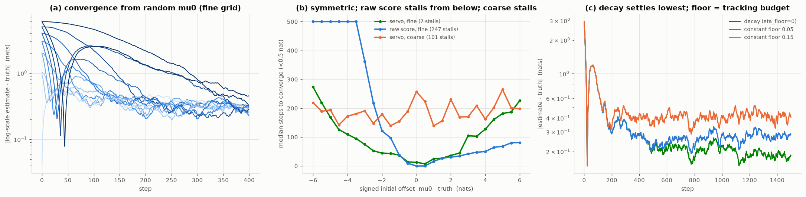

# 0008 — online convergence, and the servo it forced

Reading of [`0007_online_convergence.py`](0007_online_convergence.py) and the
move it settled, [`moving_grid.py`](moving_grid.py). Question: from a random
starting centre `mu0` (a random first guess at the log-scale), with the grid
fine enough to have no dead zone, does the move converge to the truth quickly?

It does — but only after profiling replaced the naive integrator. The failures
were informative, so they are recorded.

> **⚖️ ATTRIBUTION —** _The servo is stochastic approximation: integrate a marginal-loglik score with a decaying (Robbins–Monro) step; the natural-gradient variant is Fisher scoring; the posterior-mean + raw-score composite is an engineering combination where each signal covers the other's blind side._ Prior art: Robbins–Monro 1951; Amari natural gradient 1998; recursive/online ML. The convergence-count numbers and the coarse-grid dead-zone stall are NEGATIVE-RESULTs. Status: RECOMBINATION.

## The design arc (each fix exposed by profiling)

1. **Raw score integrator — fast from above, stalls from below.** The score is
   `∝ Qg/S`. When the process nodes sit far *below* the measurement floor
   (`Qg ≪ s2`), that prefactor → 0: the filter sees the misfit (`e²/S` spikes to
   8) but the shift gradient is ~0, so the centre crawls up. Convergence from
   `mu0 = −6` took ~264 steps against ~50 from above. This is the low-SNR face of
   the shelf/cliff asymmetry (0003).

2. **Natural gradient (Fisher) — symmetric speed, but it wanders.** Dividing the
   score by the shift's Fisher information `≈½(Qg/S)²` cancels the `Qg/S`
   prefactor (`score/Fisher = (e²−S)/Qg`), and convergence became symmetric
   (~64 steps from either side). But a pure integrator on a noisy gradient has no
   restoring force: `mu` random-walked with std ~0.56 and rectified into a
   −0.4 bias. Fast, but never settles.

3. **The reversion insight — the window must *centre*, not just contain.** The
   in-frame AR(1) reverts to the frame centre, so a window frozen off-centre
   pulls the within-window posterior mean back toward its own centre: the
   estimate `mu + Σπ_i lam_i` is biased toward `mu` whenever `mu ≠ truth`. The
   estimate is unbiased only at `mu = truth`, i.e. `Σπ_i lam_i = 0`. Freezing a
   nearby-but-off window (the tempting fix for the wander) gives a biased answer.

4. **The complementary signals.** The posterior mean `Σπ_i lam_i` is a quiet,
   unbiased, restoring signal — but it *stalls from above*, where the
   over-variance shelf is flat and the posterior does not concentrate
   (`Σπ_i lam_i ≈ 0`). The raw score is the opposite: clean and strong from
   above (a steady `≈ −0.5`), suppressed from below. So the move uses their
   **sum**, `Σπ_i lam_i + w·score`: each covers the other's blind side, and
   neither amplifies noise near the truth.

5. **Robbins–Monro decay — converge to a point, or track a drift.** A constantly
   moving servo wanders (bandwidth × gradient noise). A decaying step
   `eta_t = max(eta_floor, eta/(1+t/τ))` is stochastic approximation: with
   `eta_floor = 0` it converges to the fixed point (the integrating `mu`
   time-averages a static truth); `eta_floor > 0` keeps a residual bandwidth to
   follow a drift. That floor is a tracking budget, not a free parameter.

## What is measured

- **(a) Convergence from `mu0 ∈ [−6, 6]`, fine grid.** Every start converges.
  Within ±2 nats it takes O(10–50) steps; from ±6, a few hundred. The worst
  start settles to ~0.5 nat within 400 steps.
- **(b) Convergence time vs signed offset.** The servo (fine grid) is a clean,
  **symmetric** V — the fix for step 1's asymmetry. The **raw score** (fine)
  is fast from above but **stalls from below** (247/1000 runs never converge:
  the `Qg/S` suppression). The servo on a **coarse** grid **stalls in dead
  zones** (101/1000) — *the fineness constraint of 0003 is load-bearing for
  convergence, not just for the static score*: a coarse grid's between-node
  sign inversions trap the move.
- **(c) The tracking/precision budget (static truth, start 3 nats off).** The
  decaying step settles lowest (~0.19); a constant `eta_floor = 0.05` plateaus
  at ~0.28 and `0.15` at ~0.42 — the precision surrendered to keep bandwidth.

## The user's expectation, checked

Yes: with the servo on a fine grid, the move converges from a random start
within the fineness constraint, quickly and from either side — provided the grid
is fine (a coarse grid stalls). The expectation held once the move was built
correctly; profiling was what "correctly" required.

## Open

- **From far (±6) is still a few hundred steps.** The travel is clamp-limited
  (overlap cap); a larger cap converges faster but overlaps less across the
  slide — an overlap/speed budget not yet swept.
- **`τ` and `eta_floor`** are set by hand here; the principled schedule (tie `τ`
  to the detection-lag bound, `eta_floor` to the expected drift rate) is open.
- **Two channels.** Convergence is profiled on one channel; the covered-channel
  coupling from 0004 says the two-channel move must not let either go off-grid.
