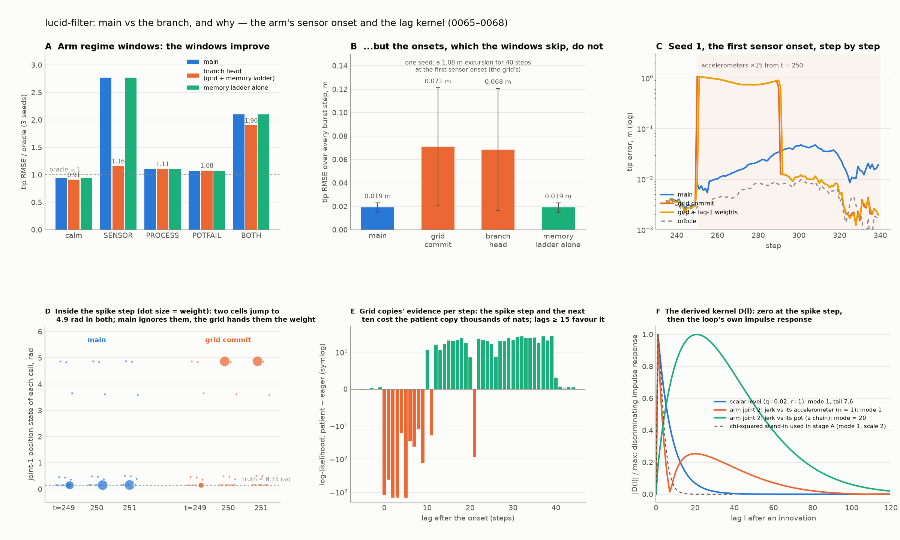

# 0067 — Patience is a lag kernel, not a slower exponential

> **AI-generated, not peer-reviewed.** Script: [`0067_lag_kernel_patch.py`](0067_lag_kernel_patch.py) (stage A:
> the walk on a kernel-weighted trailing buffer of scores, one member per kernel mode, on `main`'s source).
> Per-copy traces with [`0065_per_copy_trace.py`](0065_per_copy_trace.py); scalar A/B 12 seeds. Measurements
> in §3 as they land.

*Figure ([`0067_figure.py`](0067_figure.py)): A the arm's regime windows; B the whole-burst RMSE they skip; C seed 1's onset; D every cell's joint-1 state across the spike step, dot size the weight; E the grid copies' per-step evidence; F the derived kernel `D(l)` (0068).*

## 1. The idea (the user's, restated in the filter's terms)

Every construction so far weights past evidence by lag `k = t − s` with `w(k) = f^k`: exponential, maximal at the
current step. The memory ladder (0064) varies `f`; the attribution copies (0059) vary how much of the *current*
score the walk takes. In all of them the most recent measurement is the heaviest and "patience" only ever meant
a slower decay — a family of EMAs.

That is the wrong shape for the decision the copies exist to make. A white sensor spike and a process jump are
**indistinguishable at the step they arrive**: the same innovation, the same score on both axes. They separate on
the *next* innovation — a sensor spike reverses (the state was pulled toward it and snaps back), a process jump
persists. A kernel peaked at lag 0 therefore scores every hypothesis on the one step that carries no information
and rewards the wider prior (0059's theorem, seen from this side); a kernel peaked at lag 1–2 scores them on the
step that carries the answer. So patience is a **kernel whose mode is at a lag ≥ 1**, with a tail beyond, and
eagerness is the mode at 0. The ladder runs over kernel shapes.

Implementation: keep a trailing buffer of the last `N` per-step values, `N` where the kernel's tail mass past
the cutoff is below the aliasing tolerance `3.1e-4` (the same `ε₀` the grids use), and take the kernel-weighted
average. The natural family is the gamma in the lag, `w(l) ∝ l^{a−1} e^{−l/b}`, mode `(a−1)b`; chi-squared is
the scale-2 member (`ν` degrees of freedom: shape `ν/2`, mode `ν − 2`). The exponential is shape 1, and a
gamma of integer shape `a` is exactly the `a`-fold cascade of EMAs — which is the one-line statement of what
the current form is missing: the mode of an EMA cascade sits at `(a − 1)b`, and every construction to date
is `a = 1`.

Two sites read the kernel, and in the unified form they read the same one: the **walk** (the step on a
kernel-weighted score and information over the member's own trailing scores) and the **weights** (each rung's
evidence as the kernel-weighted sum of its members' log-likelihoods). Stage A below is the walk alone, on
`main`, with the weights as `main` has them; stage B is the weights.

## 2. Stage A: the construction

One member per class cell per kernel mode `m ∈ MODES`. Each step's innovation on an axis implies a **scale
reading** — the current scale plus that step's own clipped Newton increment, `μ_t + clip(grad/info)` — and a
mode-`m` member moves toward the kernel-weighted average of its trailing readings, `μ ← μ + K_μ (Σ_l w_m(l) r_{t−l} − μ)`,
clipped to the budget as always (the buffer is per axis; until it reaches the kernel's support the member reads
the latest only). Mode 0 is `main`'s walk exactly (verified bit-identical on the scalar rig).

*Not* this: the first form buffered the raw scores and stepped on their kernel average. That re-applies a
spike's gradient, computed at the old scale, for the whole length of the kernel after the scale has already
moved — twenty steps at the full budget — and the scales ran off to a singular innovation covariance on both
arm seeds. A kernel over lags must weight *readings* (evidence about the scale), not stale gradients; the
reading form has the fixed point the gradient form lacks (once the scale sits at the readings' average the
step is zero). The copies compete in the bank's joint posterior as
the rate copies did; `patience` is the weight on the modes above 0. Kernels used (chi-squared, `b = 2`):

| mode | `w(0..5)` | buffer `N` |
|---|---|---|
| 0 | 1 | 1 |
| 1 | 0, .26, .23, .17, .12, .08 | 20 |
| 2 | 0, .16, .19, .17, .14, .11 | 22 |
| 4 | 0, .04, .09, .13, .14, .13 | 26 |

## 3. Stage A, measured: the mode copies never take weight on the arm, and the reason is structural

Arm seed 1 (the seed with the grid's metre excursion), per-copy traces, chi-squared kernels:

| window | mixture | eager copy (mode 0): weight, own error | patient copies (modes 1 / 2 / 4): weight, own error |
|---|---|---|---|
| SENSOR onset (40 steps) | 13.96× (worst 0.091 m) | 1.00, 13.96× | 0.00, 27.9× (worst 0.224 m) — identical for modes 1, 2, 4 |
| SENSOR | 5.95× | 1.00, 5.95× | 0.00, 57× |
| PROCESS / POTFAIL / BOTH | 1.40 / 1.80 / 2.59× | 1.00 | 0.00; own errors 137× / 148× / 17× |

Seed 0 diverged to NaN under every mode set (a numerical failure of the patch on that seed, not traced). Scalar
hero, 12 seeds: jump 1.7474 → 1.8367 ({0,1}) / 1.8820 ({0,1,2,4}), steady 0.3833 → 0.3821, C unchanged — the
patient copies hold ~half the weight in calm and lose it at the jump, which they delay.

Note first what the eager copy does here against `main` on the same seed: 13.96× / 5.95× in SENSOR against
`main`'s 2.95× / 3.48×, with no metre excursion (worst 0.091 m). So on this seed the mode-0 copy is *not*
`main`'s filter even though its walk is bit-identical to `main`'s on the scalar rig — the same coupling
0065 §5 found with the rate copies (something the copies share moves the eager one), now with copies that
never win. That coupling is prior to any kernel question and is still not isolated.

Why the patient copies cannot win, from the step trace ([`diag`](0067_lag_kernel_patch.py) of one cell,
joint 0's accelerometer axis, through the onset): the walk on the arm is *rate-limited*, `K_μ × budget ≈
0.075 × 0.3 = 0.02` nats per step, so the sensor scale needs ~250 steps to climb the 5.4 nats a ×15 burst
asks for; the eager member climbs at that rate and the patient member at ~70% of it (its target averages
readings taken at older, lower scales). A sustained burst is not a transient: at every lag the reading says
"higher", the kernel has nothing to discriminate, and the patient member is simply the slower walker on
the one quantity that *is* identifiable per step — the total innovation variance. It loses the predictive
likelihood at every step and never holds weight. The kernel was applied to the magnitude of the walk; the
attribution question is about its *direction* (which of a confounded pair moves), and 0068 says what the
kernel on that direction is.

**Stage A is rejected**, for a reason that is derivable rather than measured: a lag kernel on the walk slows
the identifiable sum; the object it belongs to is the split.

## 4. What the bank does at the spike step, member by member

[`0067_diag_onset.py`](0067_diag_onset.py) on arm seed 1, the first sensor onset at `t = 250`, `main` and the
grid commit side by side. Every member's joint-1 position state (truth ≈ 0.15 rad) and the bank's weights:

| | `t = 249` | `t = 250` (the spike step) | `t = 251` |
|---|---|---|---|
| **`main`**, weights over the 15 cells | cell 11: 0.32, cell 12: 0.68 | **cell 12: 1.00** | cell 7: 1.00 |
| `main`, position state of cells 4 and 9 (the widest windows) | 0.16 | **4.87 / 4.85 rad** | 4.87 / 4.85 |
| `main`, position state of the winning cell | 0.146 | 0.153 | 0.157 |
| **grid**, weights over the eager copy's 15 cells | cell 11: 0.13, cell 12: 0.28 | **cell 4: 1.00** | cell 4: 1.00 |
| grid, position state of eager cell 4 / its patient twin | 0.146 / 0.146 | **4.87 / 2.49 rad** | 4.87 / 2.53 |
| grid, log-likelihood, eager cell 4 vs its patient twin | +25.0 vs +25.7 | **−27 vs −919** | −27 vs −1031 |

Three facts, in order:

1. **The state is destroyed inside the spike step, in `main` too.** Cells 4 and 9 — the widest `(φ, s)`
   windows — jump from 0.16 to 4.87 rad in the single update at `t = 250`. Their predicted measurement going
   in was right (0.151 against a pot reading of 0.114); the accelerometer innovation was −1.16 (a 2.6σ event
   under the burst); the star window handed the update to a far node with process and sensor scales excursed
   by +2.7 and +7.9, and at that node's gain one accelerometer innovation moves the joint by 4.7 rad. The
   misattribution is the window's, at lag 0, before any walk step — 0059's theorem seen at the level of the
   window rather than the walk.
2. **`main` survives by not listening.** Its weights hand the spike step to cell 12, whose state stays at
   0.153; cells 4 and 9 carry no weight because 250 calm steps had starved them (the exponential memory at
   0.999 had pushed them to ~e⁻³⁰), and a one-step likelihood margin cannot lift them from there. Not a rule —
   an accident of the memory.
3. **The grid listens.** The attribution leak mixes each cell's weight toward its twin's at `1/mem` every step,
   which floors cell 4's eager weight at ~`r ×` its twin's; from that floor the spike step's likelihood margin
   (a window that explains the spike by misattributing beats one that cannot, by ~900 nats) hands cell 4
   the entire weight at `t = 250`, and the tip follows its 4.87-rad state — the metre. The patient twin is
   scored −919 at the same step for *not* misattributing, its cumulative evidence goes to −∞, and only the
   leak revives it forty steps later (0065 §5's "shared piece" was this: not states, weights).

This is the user's statement made exact: the spike step is the uninformative step, the score at that step
rewards the widest prior, and the bank's weights currently read it at full strength. 0068's `D(0) = 0` says
what to do — the weights must not read a step's evidence until the members' *responses* to it are visible.
The minimal form is a one-step lag on the weight update, `L_t = f L_{t−1} + ℓ_{t−1}`, the kernel
`w(0) = 0, w(l) = f^{l−1}` — which is exactly the scalar `D(l)` of 0068 — with the predictive-density
report left at lag 0. Under it the spike step cannot move the weights; at `t + 1` cell 4 predicts 4.87 rad
against a reading of 0.03 and cannot win. [`0067_lag1_weights_patch.py`](0067_lag1_weights_patch.py) builds
it on `main` and on the grid commit; measurements in §5.

## 5. The lag-1 weights, measured: neutral on `main`, and not enough for the grid

| | `main` | `main` + lag-1 weights | grid | grid + lag-1 weights |
|---|---|---|---|---|
| arm, 3 seeds: regimes, worst errors, burst RMSE | — | **bit-identical to `main`** | seed 1: 1.083 m at SENSOR+0, 41 steps; SENSOR 8.00 | seed 1: **1.072 m at SENSOR+1, 41 steps; SENSOR 13.41**; seed 0's BOTH excursion 0.384 → 0.344 m |
| scalar hero, 12 seeds: jump / steady / C | 1.7474 / 0.3833 / 0.8890 | 1.7548 / 0.3834 / 0.8870 | | |

Delaying the evidence by one step moves nothing on `main` (its spike-step weight already went to a sane
cell) and does not repair the grid's onset. The per-copy trace under the lag-1 weights: the eager copy still
holds 0.99 of the weight through the onset window at 141× the oracle. So §4's reading was incomplete. The
spike step is where the state is destroyed, but it is not the only step that rewards it: **a destroyed cell
is self-consistent under its own inflated noise.** Cell 4's window excursed its sensor scales to +7.6, and
with the pots claimed at ×e⁷·⁶ its 4.87-rad position error costs it ~4 nats per pot channel per step (the
entropy of the claim), while the sane cells — whose walk climbs at 0.02 nats per step toward the 5.4 nats a
×15 burst asks for — are surprised by ~1000 nats per step on ten accelerometer channels until they get there.
The degenerate cell out-scores the honest ones at every lag for as long as the honest walk takes, which is
the ~40 steps of the excursion. `main`'s SENSOR window (2.7–3.5× oracle) is the same rate limit seen from the
mixture. A kernel over lags delays when evidence is read; it does not change what the evidence says, and
what it says here is blind to the position for the same reason 0064 derived — the destroyed cell has made the
pots uninformative and the score cannot see the state.

What the theory of 0068 then points at is the **window**, not the weights: the attribution on this rig is
made inside the star window at lag 0 — an accelerometer spike excurses the process axes' and the pots'
windows in the same update — and that is the place `D(0) = 0` has to be applied: an innovation on one sensor
may move that sensor's window at lag 0, and the windows of the axes it is confounded with only when the
lag-`l` evidence (`D(l)`, the loop's own impulse response) has arrived. That is a change to the window's
per-axis node weights, not to the bank's weights, and it is the next build. The stage-A copies (§3) and the
lag-1 weights (§5) are both retired, each for a reason the derivation names.
