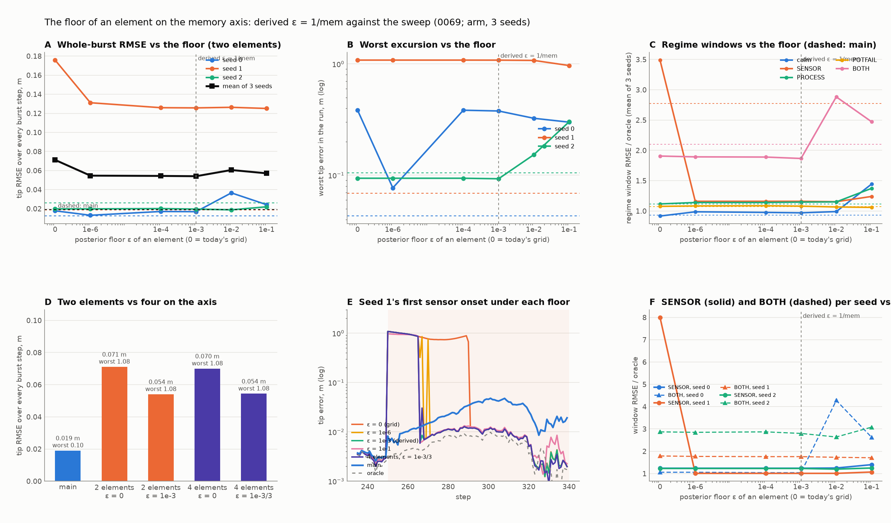

# 0069 — The floor of an element on the memory axis

> **AI-generated, not peer-reviewed.** Script: [`0069_posterior_floor_patch.py`](0069_posterior_floor_patch.py)
> (a posterior floor `ε` on the rung marginals of the attribution copies, and the elements of the axis as a
> list), run with the per-seed arm battery of 0065 and the onset data of 0067. Measurements in §3.

## 1. The observation that starts this

0067 §4's table has the patient copy's best cell at weight 1e⁻²²⁷ one step after the onset, and 0067 §6's
trace has it climbing from 1e⁻³⁰⁰ through 1e⁻¹⁴⁴, 1e⁻²⁹ to 0.9 over forty steps. Log-weights of minus
hundreds after one step mean that one observation carried hundreds of nats of evidence between two settings
of the *same* estimator. No observation with intrinsic noise can do that; a posterior that does has used the
observation to overrule its own prior about the world, and a mixture whose elements can be driven there is a
winner-take-all switch between "explain everything" and "explain nothing" — which is what two elements on
the axis are, and what a ladder of intermediate elements would have softened.

## 2. The floor, derived

The elements of the memory axis are not hypotheses about the world; they are timings of one model (0062).
The bank's own class says the world may leave any hypothesis with probability `r = 1/mem` per step — the
derived switching rate. So at every step there is prior probability `r` that the *other* element is the
right one from here on, whatever the observation says. A posterior that assigns an element less than that
after one step has let one noisy observation overrule the class's own switching prior, which one observation
cannot do: the per-step log-odds between elements is bounded by `log(1/r)`, and the floor of an element's
posterior weight is

    ε = r / (k − 1) = 1 / (mem (k − 1)),      k elements on the axis;   ε = 10⁻³ for the two-copy grid.

Today the switching kernel floors the *prior* at this value (`_attribution_mix`), and the likelihood then
multiplies the prior by e⁻¹⁰⁰⁰; the floor never reaches the posterior. The patch floors the posterior rung
marginal after the update and writes the floor back into the log-weights, so the bound holds step to step.

What this floor is *not*: a statement about which element is right. It is the statement that one step's
evidence between two timings of one estimator is worth at most the class's own switching odds. If the
measured optimum sits elsewhere, the derivation is wrong or incomplete, and §3 says which.

## 3. Measurements

*([`0069_figure.py`](0069_figure.py)) A whole-burst RMSE per seed and mean; B worst excursion; C regime windows (mean);
D two elements vs four; E seed 1's onset under each floor; F SENSOR and BOTH per seed.*

| ε (two elements) | 0 (the grid) | 10⁻⁶ | 10⁻⁴ | **10⁻³ (derived)** | 10⁻² | 10⁻¹ |
|---|---|---|---|---|---|---|
| whole-burst RMSE, mean of 3 seeds (m) | 0.0711 | 0.0546 | 0.0544 | **0.0541** | 0.0606 | 0.0571 |
| seed 1: steps with tip error > 0.2 m | 41 | 19 | 17 | **16** | 18 | 18 |
| seed 1: worst excursion (m) | 1.083 | 1.083 | 1.083 | 1.082 | 1.076 | 0.968 |
| seed 1 SENSOR window | 8.00 | 1.01 | 1.01 | 1.01 | 1.01 | 1.07 |
| calm / PROCESS windows, mean | 0.92 / 1.12 | 0.99 / 1.12 | 0.98 / 1.14 | 0.97 / 1.15 | 0.99 / 1.15 | **1.45 / 1.37** |
| four elements {1, .1, .01, .001} | 0.0700 (ε = 0; seed 1: 41 steps, SENSOR 9.09) | | | 0.0544 (ε = 10⁻³/3; 17 steps) | | |

Read plainly:

1. **The floor works as a floor and its magnitude is a plateau, not a minimum.** Every ε from 10⁻⁶ to 10⁻³
   gives the same result (0.054 m, the seed-1 plateau cut from 41 steps to 16–19); above 10⁻² the wrong
   element is kept alive enough to contaminate the calm and PROCESS windows (1.45 / 1.37 at 10⁻¹). The derived
   value sits at the **upper edge of the flat region** — the largest floor that does not hurt — which is the
   same signature the derived switching rate had in 0062 (flat on the admissible side, degrading past the
   bound), and is what "the class's own switching odds" should look like if it is a bound rather than an
   optimum. The sweep resolves the edge to within a decade; a refinement at 2·10⁻³ and 5·10⁻³ is running.
2. **It does not remove the event.** Seed 1's excursion is 1.08 m at every ε; the floor shortens how long the
   bank stays on the destroyed member (the good member climbs out of a bounded hole in ~15 steps instead of
   40) and cannot undo the spike step that destroyed it. That is the window's, per 0067 §4–5, and it is the
   reason the branch stays unmergeable whatever the floor.
3. **More elements do not substitute for the floor.** Four elements at ε = 0 are no better than two (the
   intermediate rungs are crushed at the spike step like the patient one), and at the floor they add
   nothing beyond it (0.0544 vs 0.0541). The winner-take-all is the missing floor, not the sparse axis.
4. The clamp is the instrument, not the filter (a clamp is a branch). The form that carries this into the
   filter, if the edge holds up, is the class's own jump term in every member's per-step likelihood — one more
   node in the star with prior mass `r` and the class-prior marginal as its likelihood — from which the
   floor follows as a consequence of the marginal rather than as an operation on the posterior. Not built.
