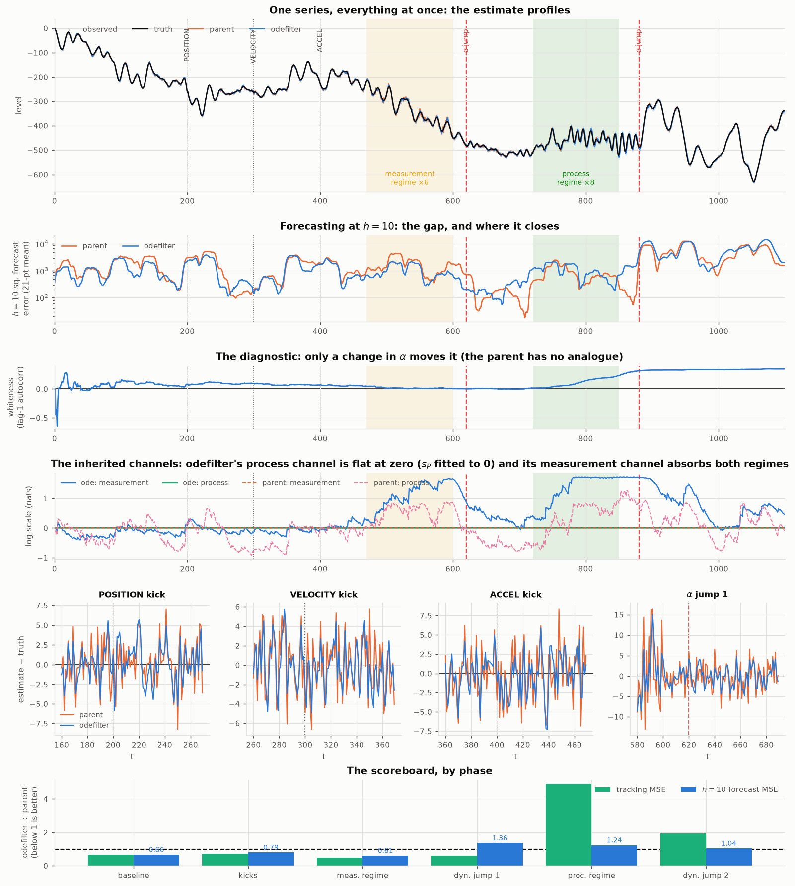

# 0033 — Where the candidate loses, and why that is the useful result

[`0032`](0032_a_hard_series.py) puts both filters on one scripted series that
exercises every axis at once: three impulsive kicks at three different
derivatives, a measurement-noise regime, a process-noise regime, and two jumps
in $\alpha$ itself. Both are fitted on the **baseline stretch only** — the clean
history before the first jump — and then run forward, which is the honest
deployment setting.

**The headline is that odefilter is not better overall on this series.** Over
the whole run it is **1.35× worse** on tracking and exactly level (0.999) on
forecasting. The battery in `0026` said 1.5–3.7× better; this says level. Both
are true, and the difference between them is the whole point.

> **⚖️ ATTRIBUTION —** _A measured failure-mode analysis on one scripted rig: a fitted model degrades out-of-sample when its assumptions expire (a stale static-$\alpha$ commitment, a process-scale channel that fits dead on smooth data). The phenomena (model misspecification cost, mis-attribution of process to measurement noise) are known; the specific numbers are the original content._ Prior art: known consequences of model misspecification / non-adaptive filtering; no single canonical source. Status: NEGATIVE-RESULT.

## The scoreboard

odefilter ÷ parent, lower is better:

| phase | tracking MSE | $h{=}10$ forecast MSE |
|---|---|---|
| baseline | **0.673** | **0.662** |
| the three kicks | **0.709** | **0.794** |
| measurement regime ×6 | **0.468** | **0.608** |
| after $\alpha$ jump 1 | **0.597** | 1.365 |
| process regime ×8 | **4.941** | 1.237 |
| after $\alpha$ jump 2 | 1.944 | 1.042 |
| **all** | **1.350** | 0.999 |

**Where the model holds, it wins by a lot** — and it wins *most* where
measurement noise is worst (0.468), which is the right direction: the smoother
your belief about the dynamics, the more noise you can reject. The three kicks
cost it nothing, exactly as `0025` said they should, because an impulsive event
in any direction **is** process noise and the filter simply absorbs it.

## Two losses, both diagnosed

### 1. The process-noise regime, 4.9× worse — the dead channel, with a price

Panel 4 shows it directly: **odefilter's process-scale channel is flat at zero
for the entire series.** $s_P$ fitted to 0.000. The parent's is the most active
trace on the plot.

This is `0029`'s finding with an operational cost finally attached. For a
process this smooth $Q$ is well under 1% of $\gamma_0$, so a log-scale wobble on
$Q$ barely moves a predictive variance that $\sigma^2$ dominates; the likelihood
cannot see $s_P$ and sets it to zero. When the process noise then goes up 8×,
odefilter has no channel to express that in — and its **measurement** channel
rises instead (the blue trace climbs in the green band as well as the yellow
one). It is mis-attributing a process excursion to measurement noise, which is
precisely the confusion the parent's two-channel design exists to avoid.

The parent does not have this problem *because its model is worse*: with
$\hat\sigma^2\approx0$ and $\hat Q=67$ it explains an oscillator as a very fast
random walk, so nearly all its variance is process variance and its process
channel has something to hold.

### 2. After a jump in $\alpha$, forecasting flips to worse

1.365 and 1.042 after the two jumps, against 0.662 on the baseline. **A
confident wrong model is worse than a vague right-ish one.** The parent
commits to nothing about the dynamics and so has nothing to be wrong about;
odefilter commits, and when the commitment expires it pays. That is the cost of
the "$\alpha$ is static" commitment named in
[`0030`](0030_the_free_variable_audit.md) §2, measured.

Tracking still improves after jump 1 (0.597) — consistent with `0006`: tracking
error is nearly blind to $\alpha$, so a stale $\alpha$ costs forecasts long
before it costs tracking.

## The diagnostic works, and its one flaw is visible

Panel 3: `whiteness` sits near zero through the kicks and through **both** noise
regimes — no false alarms on any of the five non-dynamics events — then climbs
from about $t=750$ and plateaus after the second jump. It fires on exactly the
thing it is supposed to fire on.

But it is a cumulative statistic with no forgetting factor, deliberately (a
half-life would be a free parameter, `0030` §3), and the picture shows what that
costs: **it responds slowly and it never comes back down.** It says "$\alpha$
stopped fitting at some point" rather than "$\alpha$ is wrong now."

## What this changes

1. **Fixing the process-scale channel is now the top item, ahead of acting on
   `whiteness`.** The failure is a 4.9× regression on a realistic regime, it is
   fully explained, and the explanation points at a fix: the channel is
   unidentifiable *because $Q$ is small relative to $\sigma^2$*, so it needs to
   be parameterised in something the likelihood can see — a scale on the
   innovation, or on $Q_{\text{eff}}$, rather than on $Q$ alone.
2. **Acting on `whiteness` gets a measured payoff to aim at**: the 1.365 and
   1.042 after the jumps are what a refit would recover, and 0.662 is the
   ceiling.
3. **`0026`'s battery is not wrong, it is narrow.** It measured a stationary
   target class. Nothing in it, and nothing in this workstream before now, had
   asked what happens when the model's own assumptions expire mid-series.
4. Report the "all" row when quoting this filter's performance. On a series
   that breaks its assumptions three times it is level at forecasting and worse
   at tracking, and that is the number a caller deploying it should have.
