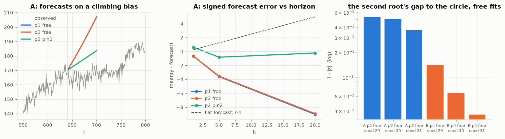

# 0041 — A climbing bias is a pinned root, and the free fit misses the circle on both sides

Probe: [`0040`](0040_can_it_find_a_climbing_bias.py) ·
numbers: [`ode040.json`](figures/ode040.json) ·
feature: `OdeFilter.fit(y, p, unit_roots=d)`

> **⚖️ ATTRIBUTION —** _A constant offset is a single root at $z=1$ and a linear (climbing) bias is a double root at $z=1$ — pinning $d$ roots there (fitting only the quotient polynomial) is exactly integrator/bias state augmentation and the imposition of $d$ unit roots / integrated-model constraints._ Prior art: Friedland 1969 ("Treatment of bias in recursive filtering") for bias/integrator augmentation; integrated (ARIMA) and unit-root modeling (Box–Jenkins); that a free ML fit places the unit root at $1\pm O(1/n)$ rather than exactly is standard near-unit-root/Dickey–Fuller bias. That differencing converts iid measurement noise into an MA(1) is textbook over-differencing. Status: REPRODUCTION.

## The mechanism, before the numbers

The model has no intercept anywhere. A constant offset can only live in a root
at $z=1$; a **linear** offset — a level whose rate of change is part of the
state, which is what a climbing or declining bias is — can only live in a
**double** root at $z=1$. That much was already in `0001` and in
the applied workstream's linear-offset probe,
which measured the structure worth +0.005 to +0.027 nats/bar by fitting the
differenced series and left first-class support as "the filter's call".

What the probe adds is *why the free fit cannot hold the root there*. The
maximum-likelihood unit root lands at $1\pm\varepsilon$ with
$\varepsilon = O(1/n)$ — measured: 1.0011–1.0069 on every free fit on drifting
data (sections A–C, always **outside** the circle there), and scattered to
both sides (0.9953–1.0007) on the no-climb data of section D. That is the
point: $\varepsilon$ is noise with a data-dependent sign, not something that
converges onto the circle at any $n$ you have. The error looks tiny and is not,
because a root is an exponent: a root at $1+\varepsilon$ represents an
*additive* climb as a *geometric growth rate of the level*, so the $h$-step
forecast multiplies the level by $(1+\varepsilon)^h$ — overshooting a real
drift by more than a flat forecast undershoots it, with a sign that depends on
which side of zero the series happens to sit. A root at $1-\varepsilon$ decays
the drift instead. Neither is a drift that *continues*.

There is an invariance underneath this, and it is the parent's own kind of
argument. Within this family, forecasts treat $y$ and $y+c$ identically for
every constant $c$ **iff** $\sum_i\alpha_i=1$ — a root exactly at 1; they
treat $y$ and $y+rt$ identically iff the root is double. The world genuinely
does not care where the origin of a level is, so a filter for drifting levels
should carry the symmetry exactly, and a free ML fit will always trade it away
for in-sample density — $\varepsilon$ is not estimation error to be waited
out, it is the trade. `unit_roots=d` buys the symmetry back by construction:
the characteristic polynomial is written as $(z-1)^d(z^m-\sum_j\beta_jz^{m-j})$
and only the quotient $\beta$ ($m=p-d$ coefficients) is searched. The map from
$\beta$ to $\alpha$ is linear and exact, $d=0$ is bit-for-bit the old fit, and
$p=1,d=1$ pins $\alpha=(1)$ — the parent, now literally a face of the
constrained family.

Everything below is prequential: fit on the first half, stream, score log
predictive density on the second half only; forecasts from rolling origins in
the second half; three seeds; `dynamics=False` throughout.

## A — the parent's ground: a walk with drift $r=0.25$, $\sigma^2=9$

| candidate | top \|root\| | nats/pt | bias at $h{=}20$ | RMSE at $h{=}20$ |
|---|---|---|---|---|
| `p1` free (≈ the parent) | 1.0033–1.0044 | −2.789 | **−6.6 to −13.2** | 11.1 |
| `p2` free | 1.0033–1.0044 | −2.786 | −6.6 to −13.0 | 11.0 |
| `p2, unit_roots=2` | 1 exactly | **−2.737** | **+0.07, +0.05, −0.77** | **8.9** |

A flat forecast is biased by $rh=+5.0$ at $h=20$; the free fits are biased
**−6.6 to −13.2** — *more* wrong than ignoring the drift, in the opposite
direction, exactly the $(1+\varepsilon)^h$ mechanism. The free `p2` fit does
not spend its second root on the drift (it lands at 0.46–0.63). The pin
removes the bias essentially entirely and is worth +0.052 nats/pt pooled
(+0.008 to +0.128 by seed).

## B — the class one order up: $(z-1)^2\times$ oscillator, in class

| candidate | gaps $1-\lvert z\rvert$ of top two roots | nats/pt | RMSE at $h{=}20$ |
|---|---|---|---|
| `p3` free (the current default) | −0.005, +0.08 | −4.227 | 3100 |
| `p4` free | −0.005, +0.08 | −4.054 | 2448 |
| `p4, unit_roots=1` | 0, +0.004 | −3.438 | 534 |
| `p4, unit_roots=2` | 0, 0 | **−3.437** | **534** |

The free `p4` fit, handed data that genuinely carries a double unit root and
enough order to express it, **never finds it**: one root overshoots the circle
(−0.004 to −0.007), the other lands well inside (+0.036 to +0.141). The cost
is +0.62 nats/pt held out and a 4.6× $h{=}20$ RMSE against the pinned fit —
on doubly integrated data an $\varepsilon$ on the wrong side compounds against
a level in the thousands.

Two structural readings. **The anchor does almost all the work**: with one
root pinned, the free part puts its own root at 0.995–1.001 — the same
"chose the double root by itself" that the applied `diff_p3` showed — and the
density is flat between `unit_roots=1` and `2` (±0.003 nats/pt). The second
pin costs nothing and completes the hypothesis. And **the pinned fit recovers
the quotient cleanly**: the oscillator pair comes back at $|z|=0.94$–0.96
against a truth of 0.949, $\hat Q=0.95$–1.11 against 1, $\hat\sigma^2=8.7$–9.2
against 9 (now also a slow test).

## C — out of class twice, and the honest failure

A deterministic trend over an *integrated* oscillator. Differencing the trend
away turns the white process noise into $(1-L)w$, so no candidate's class
contains this data — including the pinned one.

| candidate | nats/pt | $\hat Q$ | RMSE at $h{=}20$ |
|---|---|---|---|
| `p3` free | **−3.124** | 0.8–1.3 | **45** |
| `p4` free | −3.124 | 2.0–3.1 | 45 |
| `p4, unit_roots=2` | −3.268 | **8.5–42** | 159 |

The pin loses: ML inflates $Q$ to keep the slope state loose enough to absorb
the overdifferenced noise, and the slope estimate then jitters — forecasts
swing by ±100–200 where the truth moves 8. This was first seen as a wild
smoke-test fit and is the recorded failure mode: **when the pinned class is
wrong, the damage lands in $Q$ and in long-horizon variance, not in a subtle
bias**. The prequential score sees it (−0.14 nats/pt) and picks the free fit
on all three seeds.

## D — pinning when wrong, priced

On data with a constant offset and no climb: the *right* pin (`unit_roots=1`)
costs **+0.0003 nats/pt pooled** — nothing, the same answer as `0007` fact 8's
$\chi^2$ result, now at the fit interface. The *wrong* pin (`unit_roots=2`)
costs **−0.148 nats/pt** and 3.7× the $h{=}20$ RMSE. So the premium/exposure
ledger is: asserting a constant offset is free when true; asserting a climb
that is not there is expensive but **loud** — three orders of magnitude above
the ±0.0004 resolution `0039` established for this criterion, so the same
prequential density that fits the filter decides $d$ reliably. It decided
correctly in every section of this probe.

## E — the pin beats the differencing recipe that motivated it

Same hypothesis two ways on the section-B data: the external `fit(p=3)` on
$\Delta y$ against the internal `fit(p=4, unit_roots=1)` on $y$ (identical
root budget; one-step densities comparable, Jacobian 1):

| seed | external (difference first) | internal (pin) | internal − external |
|---|---|---|---|
| 29 | −3.4723 | −3.4490 | **+0.023** |
| 30 | −3.4461 | −3.3946 | **+0.052** |
| 31 | −3.5039 | −3.4694 | **+0.034** |

Differencing hands the filter a measurement noise it cannot represent — iid
$v_t$ becomes MA(1) $\Delta v_t$ — and at $\sigma^2=9$ that tax is +0.036
nats/pt pooled, larger than the entire +0.005 to +0.027 gain measured
*through* the tax. The constraint belongs inside the filter, where the noise
stays in class.

## What is not established

- **Nothing here selects $d$ automatically.** The decision is one prequential
  comparison and section D shows it is well-posed; wiring it into `fit` (the
  way order selection was measured in `0030`) is deliberately not done —
  same reason `p` is a commitment, not a dial.
- **The dynamics channel is untested against pinned roots.** With a pinned
  base, `alpha_at(g)` preserves the $z=1$ root at every $g$ (both endpoints
  carry it) but the double root only at $g=1$ — which is the right semantics,
  a drift that can stop governing — and `_radius`'s tolerance sits at
  $1+10^{-9}$ while a numerically-split double root lands at $1\pm10^{-8}$.
  Every fit here ran `dynamics=False`; crossing the two channels needs its own
  probe.
- **Section C's data is one adversary.** "Deterministic trend + integrated
  oscillator" was chosen because it defeats everyone; a sweep of how far out
  of class the pin stays useful was not run.
- The class still injects all process noise through $u=e_1$, so a pinned slope
  *wanders* with the same $Q$ that drives everything else. A deterministic
  slope over in-class noise is inexpressible with any $d$ — that is the
  $u=e_1$ commitment again (`0030`), now with a concrete casualty.
