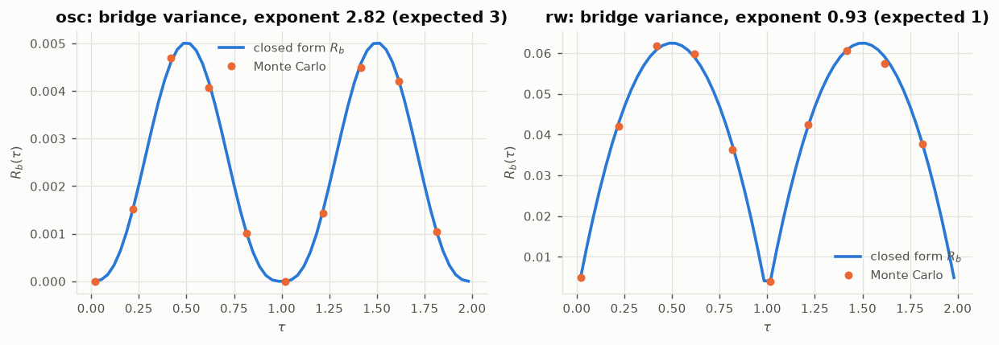
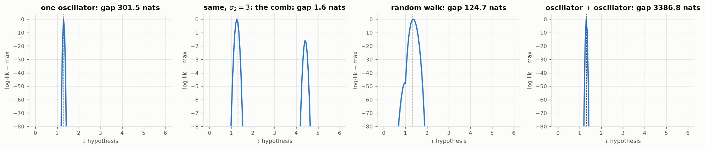
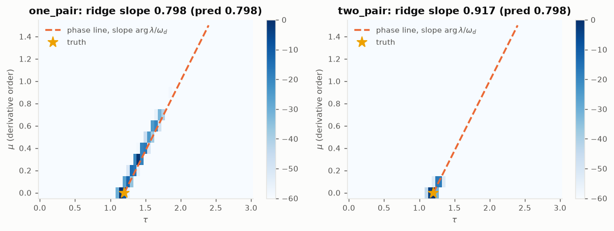
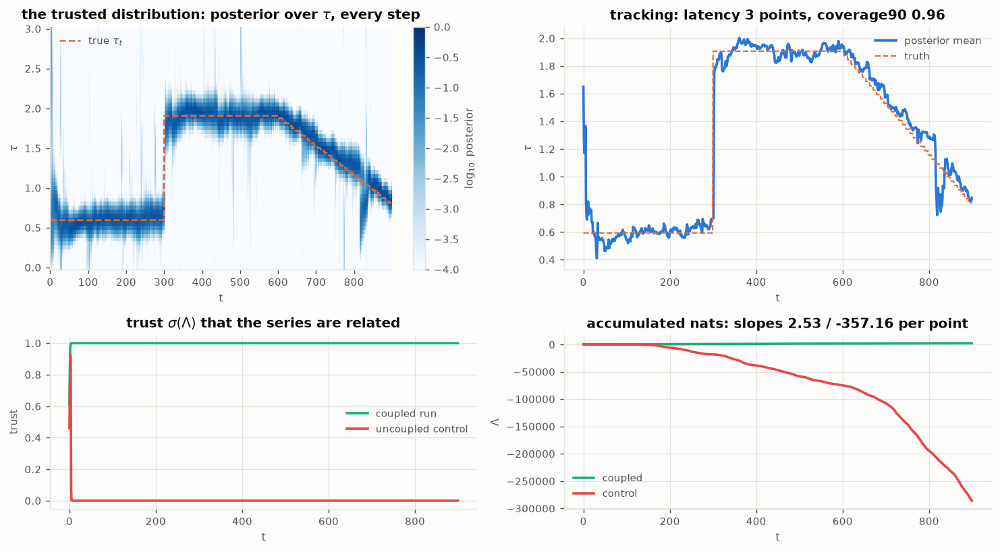

# 0045 — What the offset probes settle

From [`0043`](0043_the_delay_row.py) (delay row, bridge, aliasing, ridge) and
[`0044`](0044_tracking_the_offset.py) (online tracking). Raw numbers in
`figures/ode043.json`, `figures/ode044.json`; the frame and claims list is
[`0042`](0042_the_offset_frame.md) §7.

> **⚖️ ATTRIBUTION —** _These are measurements confirming the constructions of `0042` (fractional-delay observation row, bridge variance, aliasing comb, derivative/lag ridge, online mixture tracking). The phase-ambiguity ("aliased comb") of a narrowband delay and its resolution by bandwidth/SNR is the classical time-delay-estimation ambiguity; a derivative being a quarter-period phase lead is elementary. Prior art: time-delay estimation and phase ambiguity (Knapp & Carter 1976); MMAE tracking (above). Status: RECOMBINATION (measurement)._

## 1. The delay row is exact, and the bridge is priced correctly

$e_x^\top e^{-\tau G}$ reproduces $x(t-\tau)$ on the noiseless solution space to
$6\times10^{-14}$ (claim 1). With process noise, the bridge row's closed-form
residual variance matches Monte Carlo within 0.97–1.02 at every $\tau$ tested,
for both the oscillator and the random-walk latent (claim 2).
$R_b(\tau)$ vanishes at integer $\tau$ and its endpoint exponents measure
**2.82** (oscillator; predicted $2m-1=3$) and **0.93** (random walk; predicted
1) over the window $s\in[0.02,0.16]$ — the finite-$s$ fit biases both slightly
low, but the two smoothness classes separate cleanly and in the predicted
direction. Fractional reads are cheaper the smoother the noise entry, priced by
the same currency as the differencing cost.

## 2. Aliasing is real, and it is an SNR statement — this is the surprise

The comb exists exactly where predicted: the one-oscillator profile's second
peak sits at $1.3+2\pi/\omega_d=4.45$ (claims 3). But its depth refutes the
naive reading of "damping separates the peaks only weakly":

- At $\sigma_2=0.3$ the alias sits **301 nats** below the true peak
  (0.53 nats/point) — and **freeing the gain $c$ changes the gap by nothing at
  all**. The separation is not the $r^{-\tau}$ amplitude channel.
- Swept over damping at fixed noise, the separation is **linear in $\gamma$**
  while small: 0.099 / 0.244 / 0.532 / 1.017 / 1.65 nats/point at
  $\gamma$ = 0.0125 / 0.025 / 0.05 / 0.1 / 0.2.
- Swept over noise at fixed $\gamma=0.05$: 1.11 / 0.53 / 0.066 / **0.0026**
  nats/point at $\sigma_2$ = 0.1 / 0.3 / 1.0 / 3.0.

So the alias is separated by the **path-tracking (bridge/innovation) channel**:
the filter reconstructs the latent path, and reading it one period late
mismatches by the path's decorrelation over $\Delta\tau=2\pi/\omega_d$ — a
damping × SNR effect. The mean-channel aliasing picture of `0042` §3 is the
$\text{SNR}\to0$ limit, where the comb becomes genuinely near-degenerate
(1.6 nats total at $\sigma_2=3$, visible in the second panel). At working SNR
the aliasing is broken *by the same channel that makes the random walk
identifiable at all*.

The other two panels land as predicted (claims 4, 5): the random-walk latent
gives one broad unaliased peak (τ̂ = 1.35 against 1.3, grid step 0.05) with the
information coming entirely from the noise-correlation structure — the mean
channel of a unit root is $\tau$-blind — and a second oscillator collapses the
profile to a single sharp peak (3387 nats to the nearest rival).

## 3. A derivative is a quarter-period lead — to four figures

On one oscillator pair with the gain free, the $(\mu,\tau)$ likelihood surface
is a ridge along the phase line (claim 6): measured slope
$d\tau/d\mu = \mathbf{0.7976}$ against the predicted
$\arg\lambda/\omega_d = \mathbf{0.7979}$. Derivative order and lag are
exchangeable along that line at the rate of a quarter period per order — but
not exactly: the ridge is **weakly broken by the same stochastic channel as
§2**, dropping 67.6 nats (0.12/point) by $\mu=1$, because a differentiated
autocovariance is not quite a shifted one (the kink at zero lag moves). With a
second pair the ridge collapses to a point and the argmax lands on the truth
$(\mu,\tau)=(0,1.2)$, with the $\mu=1$ ridge point 1048 nats down.

So the identifiability ladder of `0042` §5 is measured, with one refinement:
"unanswerable on a single oscillator" holds for the mean channel; the
stochastic channel answers slowly (0.12 nats/point here), at a rate that the
§2 sweeps say scales with damping × SNR.

## 4. The trusted distribution tracks, and the ledger arithmetic transfers

The gridded-$\tau$ mixture (61 nodes, kernel = random-walk steps
$s_\tau=0.02$ + restart mass $\varepsilon=10^{-3}$, null member outside the
kernel) on a latent carrying both channels (random-walk level + oscillator),
with $\tau$ jumping 0.6→1.9 at $t=300$ and ramping 1.9→0.8 over $t\in[600,900)$
(claim 7):

| | measured |
|---|---|
| RMS $\tau$ error, static segments | **0.044 / 0.043** (grid step 0.05) |
| RMS $\tau$ error, ramp | 0.099 |
| central-90% coverage | **0.957** |
| relocation latency after the 1.3 jump | **3 points** |
| ledger prediction $(\log\frac1\varepsilon+\log 99)/\widehat{\mathrm{KL}}$ | 2.1 points ($\widehat{\mathrm{KL}}=5.48$/pt) |
| trust $\sigma(\Lambda)$, coupled run | saturated by $t=20$ |
| trust, uncoupled control | $\to 0$, $\Lambda$ slope $-357$/pt |

The parent's confirmation-ledger arithmetic priced the relocation within one
point of the measurement. Two honest caveats. First, the control's enormous
negative slope is **not** a calibrated statement: it is the coupled family
being wrong-and-certain on out-of-model data (the mixture confidently shares
its level with a series that has its own), against a deliberately vague
matched-marginal null. The trust *semantics* land correctly — the sign and the
collapse — but the rate says more about overconfidence than about evidence.
Second, at this SNR the problem is easy (per-point KL between distant nodes
≈ 5.5 nats); the low-SNR regime, where §2 says aliasing genuinely bites and
relocation would be slow, was profiled offline but not tracked online.

## 5. Standing state, and what was deliberately not done

**Settled by measurement:** the delay row and its bridge pricing (exact /
0.97–1.02 of MC); the comb at $2\pi/\omega_d$ and its resolution by damping ×
SNR, by a rough channel, or by a second mode; the quarter-period
derivative/lag exchange rate and its weak stochastic breaking; online tracking
of a jumping and ramping offset with honest coverage and ledger-consistent
latency.

**Asserted in `0042` and still unprobed:** negative $\tau$ via deferred
updates ("a lead is a lag in processing time") — construction recorded, never
run. The saturated-member (free $b$) Occam bracket — the trust ladder's upper
rail — is designed but not implemented online. $s_\tau$, $\varepsilon$, $c$
were fixed, not learned; each is in-model and learnable by marginal likelihood
in principle.

**A known modelling gap, chosen deliberately:** the probes use the exact
discrete-time model of the continuous SDE (so that likelihood comparisons
isolate $\tau$), while `core.py`'s class is AR($p$) + white noise — the
continuous world sampled in position only is ARMA($p$,$p{-}1$)-like, not
AR($p$). Folding the $\tau$ channel into `output/odefilter` therefore needs
either the lag-basis GLS form of the bridge row (regression of the delayed
value on the stored lags, with the residual as the floor — same construction,
`core.py`'s state) or an acknowledgement of that class gap. Neither is done.

**One reframe worth keeping:** `0024` left "is the oscillator phase readable?"
open as the coordinate with no parent analogue. The offset extension answers
what the phase *is for*: a lead/lag measurement is a phase measurement of the
oscillator channel, and a second series is the instrument that reads it.
